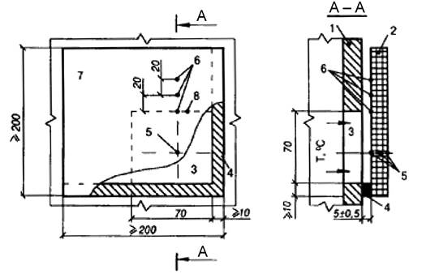
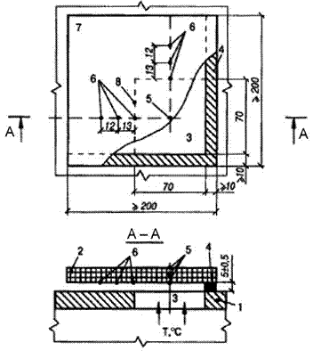
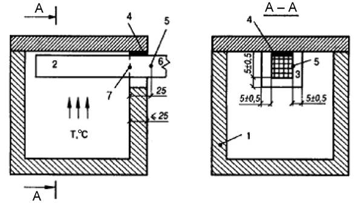

# ДЕРЖАВНІ БУДІВЕЛЬНІ НОРМИ УКРАЇНИ

**ПОЖЕЖНА БЕЗПЕКА ОБ'ЄКТІВ БУДІВНИЦТВА**

**Загальні вимоги**

ПОЖАРНАЯ БЕЗОПАСНОСТЬ ОБЪЕКТОВ СТРОИТЕЛЬСТВА

Общие требования

FIRE SAFETY OF CONSTRUCTION

General requirements

**Чинні від 2017-06-01**

# 1 СФЕРА ЗАСТОСУВАННЯ

**1.1** Ці будівельні норми (надалі - Норми) встановлюють загальні вимоги пожежної безпеки до будинків, будівель, споруд будь-якого призначення (далі - будинків), що спрямовані на обмеження поширення пожежі між будинками, обмеження поширення пожежі в будинках; забезпечення безпечної евакуації людей; забезпечення гасіння пожежі та проведення рятування людей під час пожежі; застосування систем протипожежного захисту.

На будинки та їх частини, що призначені для виробництва, зберігання і утилізації вибухових речовин і засобів підривань; будинки та приміщення військового призначення; шахти, тунелі, підземні споруди метрополітенів, а також на захисні споруди цивільного захисту вимоги цих Норм поширюються в частині:

- вітчизняної пожежної класифікації будівельних матеріалів;

- типів протипожежних перешкод, заповнення прорізів у них, типів протипожежних тамбур-шлюзів щодо межі поширення вогню по протипожежних перешкодах;

- визначення ступеня вогнестійкості будинків та їх умовної висоти, а також класів вогнестійкостібудівельних конструкцій;

- визначення типів сходів, сходових кліток та зовнішніх пожежних драбин.

**1.2** Ці Норми застосовують під час проектування і будівництва будинків, також їх реконструкції, капітального ремонту, технічного переоснащення, реставрації.

**1.3** Цими Нормами встановлюються основні вимоги щодо забезпечення пожежної безпеки будинків. Ці вимоги можуть бути уточнені в інших нормативних актах та документах системи стандартизації та нормування в будівництві (надалі - НД), при цьому вимоги інших НД не повинні знижувати вимог цих Норм.

# 2     НОРМАТИВНІ ПОСИЛАННЯ

У цих Нормах є посилання на такі нормативні документи:

НАПБ А.01.003-2009 Правила улаштування та експлуатації систем оповіщення про пожежу та управління евакуацією людей в будинках та спорудах

НПАОП 40.1-1.32-01 Правила будови електроустановок. Електрообладнання спеціальних установок

ДБН 360-92\*\* Містобудування. Планування та забудова міських і сільських поселень

ДБН А.2.2-3:2014 Склад та зміст проектної документації на будівництво

ДБН Б.2.4-1-94 Планування і забудова сільських поселень

ДБН Б.2.4-3-95 Генеральні плани сільськогосподарських підприємств

ДБН В.1.2-7:2008 Система забезпечення надійності та безпеки будівельних об'єктів. Основні вимоги до будівель і споруд. Пожежна безпека

ДБН В.1.2-14-2009 Система забезпечення надійності та безпеки будівельних об'єктів. Загальні принципи забезпечення надійності та конструктивної безпеки будівель, споруд, будівельних конструкцій та основ

ДБН В.2.2-9-2009 Будинки і споруди. Громадські будинки і споруди. Основні положення

ДБН В.2.2-15-2005 Будинки і споруди. Житлові будинки. Основні положення

ДБН В.2.2-24:2009 Будинки і споруди. Проектування висотних житлових і громадських будинків

ДБН В.2.2-28:2010 Будинки і споруди. Будинки адміністративного та побутового призначення

ДБН В.2.3-15:2007 Споруди транспорту. Автостоянки і гаражі для легкових автомобілів

ДБН В.2.5-23-2010 Інженерне обладнання будинків і споруд. Проектування електрообладнання об'єктів цивільного призначення

ДБН В 2.5-28-2006 Інженерне обладнання будинків і споруд. Природне і штучне освітлення

ДБН В.2.5-56:2014 Системи протипожежного захисту

ДБН В.2.5-64:2012 Внутрішній водопровід та каналізація. Частина І. Проектування. Частина ІІ. Будівництво

ДБН В.2.5-67:2013 Опалення, вентиляція та кондиціонування

ДБН В.2.5-74:2013 Водопостачання. Зовнішні мережі та споруди. Основні положення проектування

ДБН В.2.6-14-97 Конструкції будинків i споруд. Покриття будинків i споруд

ДБН В.3.2-1-2004 Реконструкція, ремонт, реставрація об'єктів невиробничої сфери. Реставраційні, консерваційні та ремонтні роботи на пам'ятках культурної спадщини

ДСТУ 2272:2006 Пожежна безпека. Терміни та визначення основних понять

ДСТУ 2273:2006 Протипожежна техніка. Терміни та визначення основних понять

ДСТУ 7201:2010 Норми безпеки до конструкції та експлуатації ліфтів. Частина 72. Ліфти пожежні (EN 81-72:2003, MOD)

ДСТУ 7313:2013 Знаки безпеки та системи евакуаційні фотолюміносцентні. Загальні вимоги та методи контролювання

ДСТУ ISO 6309:2007 Протипожежний захист. Знаки безпеки. Форма та колір (ІSO 6309:1987, ІDT)

ДСТУ ISO 7240-1:2007 Системи пожежної сигналізації та оповіщування. Частина 1. Загальні положення, терміни та визначення понять (ISO 7240-1:2005, ІDТ)

ДСТУ EN 13501-1:2016 Пожежна класифікація будівельних виробів і будівельних конструкцій. Частина 1. Класифікація за результатами випробувань щодо реакції на вогонь (EN 13501-1:2007+ А1:2009, IDT)

ДСТУ EN 13501-2:2016 Пожежна класифікація будівельних виробів і будівельних конструкцій. Частина 2. Класифікація за результатами випробувань на вогнестійкість, крім складників вентиляційних систем (EN 13501-2:2007+A1:2009, IDT)

ДСТУ EN 13501-3:2016 Пожежна класифікація будівельних виробів і будівельних конструкцій. Частина 3. Класифікація за результатами випробувань на вогнестійкість виробів та конструкцій, які використовують в інженерних системах будівель. Вогнестійкі повітроводи та протипожежні клапани (EN 13501-3:2005 + A1:2009, IDT)

ДСТУ Б В.1.1-2-97 (ГОСТ 30402-96) Захист від пожежі. Матеріали будівельні. Метод випробувань на займистість

ДСТУ Б В.1.1-4-98\* Захист від пожежі. Будівельні конструкції. Методи випробувань на вогнестійкість. Загальні вимоги

ДСТУ Б В.1.1-18:2007 Захист від пожежі. Споруди та фрагменти будівель. Метод натурних вогневих випробувань. Загальні вимоги

ДСТУ Б В.1.1-36:2016 Визначення категорій приміщень, будинків та зовнішніх установок за вибухопожежною та пожежною небезпекою

ДСТУ Б В.2.6-49:2008 Конструкції будинків і споруд. Огорожі сходів, балконів і дахів сталеві. Загальні технічні умови

ДСТУ Б В.2.6-77:2009 Конструкції будинків і споруд. Двері металеві протипожежні. Загальні технічні умови

ДСТУ Б В.2.7-19-95 (ГОСТ 30244-94) Будівельні матеріали. Матеріали будівельні. Методи випробувань на горючість

ДСТУ Б В.2.7-70-98 (ГОСТ 30444-97) Будівельні матеріали. Метод випробування на розповсюдження полум'я

ДСТУ Б EN 1366-2:2013 Методи випробувань на вогнестійкість інженерних систем. Протипожежні клапани (EN 1366-2:1999, IDT)

ДСТУ-Н Б В.1.2-16:2013 Визначення класу наслідків (відповідальності) та категорії складності об'єктів будівництва

ДСТУ-Н Б В.2.2-38:2013 Настанова з улаштування пожежних ліфтів в будинках та спорудах

ДСТУ-Н Б В.2.6-211:2016 Проектування сталевих конструкцій. Розрахунок конструкцій на вогнестійкість

ДСТУ-Н Б EN 1991-1-2:2010 Єврокод 1. Дії на конструкції. Частина 1-2. Загальні дії. Дії на конструкції під час пожежі (EN 1991-1-2:2002, IDT)

ДСТУ-Н Б EN 1992-1-2:2012 Єврокод 2. Проектування залізобетонних конструкцій. Частина 1-2. Загальні положення. Розрахунок конструкцій на вогнестійкість (EN 1992-1-2:2004, IDT)

ДСТУ-Н Б EN 1993-1-2:2010 Єврокод 3. Проектування сталевих конструкцій. Частина 1-2. Загальні положення. Розрахунок конструкцій на вогнестійкість (EN 1993-1-2:2005, IDT)

ДСТУ-Н Б EN 1994-1-2:2012 Єврокод 4. Проектування сталезалізобетонних конструкцій. Частина 1-2. Загальні положення. Розрахунок конструкцій на вогнестійкість (EN 1994-1-2:2005, IDT)

ДСТУ-Н Б EN 1995-1-2:2012 Єврокод 5. Проектування дерев'яних конструкцій. Частина 1-2. Загальні положення. Розрахунок конструкцій на вогнестійкість (EN 1995-1-2:2004, IDT)

ДСТУ-Н Б EN 1996-1-2:2012 Єврокод 6. Проектування кам'яних конструкцій. Частина 1-2. Загальні положення. Розрахунок конструкцій на вогнестійкість (EN 1996-1-2:2005, IDT)

ДСТУ-Н Б EN 1999-1-2:2010 Єврокод 9. Проектування алюмінієвих конструкцій. Частина 1-2. Розрахунок конструкцій на вогнестійкість (EN 1999-1-2:2007, IDT)

ГОСТ 12.1.044-89 ССБТ. Пожаровзрывоопасность веществ и материалов. Номенклатура показателей и методы их определения (ССБП. Пожежовибухонебезпека речовин і матеріалів. Номенклатура показників і методи їх визначення)

ГОСТ 12.4.009-83 ССБТ. Пожарная техника для защиты объектов. Основные виды. Размещение и обслуживание (ССБП. Пожежна техніка для захисту об'єктів. Основні види. Розміщення та обслуговування)

ГОСТ 12.4.026-76 ССБТ. Цвета сигнальные и знаки безопасности (ССБП. Кольори сигнальні і знаки безпеки)

ГОСТ 16363-98 Средства огнезащитные для древесины. Методы определения огнезащитных свойств (Засоби вогнезахисні для деревини. Методи визначення вогнезахисних властивостей)

СТ СЭВ 446-77 Противопожарные нормы строительного проектирования. Методика определения расчетной пожарной загрузки (Протипожежні норми будівельного проектування. Методика визначення розрахункового пожежного навантаження)

СНиП ІІ-89-80 Генеральные планы промышленных предприятий (Генеральні плани промислових підприємств)

СНиП 2.11.06-91 Склады лесных материалов. Противопожарные нормы проектирования (Склади лісових матеріалів. Протипожежні норми проектування)

Правила устройства электроустановок (6-е издание, переработанное и дополненное). Энергоатомиздат, 1987 г. (Правила улаштування електроустановок (6-е видання, перероблене і доповнене). Енергоатомвидав, 1986 року

# 3     ТЕРМІНИ ТА ВИЗНАЧЕННЯ ПОНЯТЬ

Нижче подано терміни, вжиті в цих будівельних нормах, та визначення позначених ними понять

## 3.1 індивідуальні засоби захисту та рятування людей

Засоби для захисту органів дихання, зору та відкритих ділянок тіла, від продуктів згоряння; самостійного рятування з поверхів будинку

**3.2 колективні засоби захисту та рятування людей**

Засоби захисту та рятування під час пожежі, якими одночасно може користуватися група людей

## 3.3 незадимлювана сходова клітка

Сходова клітка з конструктивними, планувальними та/або інженерними рішеннями, що унеможливлюють потрапляння до неї продуктів згоряння під час пожежі

## 3.4 опорний пожежний пункт

Приміщення для розміщення індивідуальних і колективних засобів захисту та рятування людей, первинних засобів пожежогасіння, протипожежного інвентарю, необхідного у разі виникнення пожежі для персоналу та пожежно-рятувальних підрозділів

**3.5 протипожежна відстань**

Нормована відстань між Будинками, яку встановлюють для запобігання розвитку пожежі

## 3.6 протипожежний відсік

Частина будинку, відокремлена від інших його частин протипожежними стінами 1-го типу та/або протипожежними перекриттями 1-го типу. Призначенням протипожежного відсіку є запобігання поширенню пожежі та її небезпечних чинників за його межі (у разі виникнення пожежі всередині відсіку) або у протипожежний відсік (у разі виникнення пожежі ззовні відсіку) протягом нормованого часу

## 3.7 протипожежна секція

Частина протипожежного відсіку, відокремлена від інших його частин протипожежними перешкодами, крім протипожежних стін 1-го типу та/або протипожежних перекриттів 1-го типу

## 3.8 протипожежний тамбур-шлюз

Об'ємний елемент частини приміщення, відокремлений від інших частин приміщення протипожежними перешкодами та розташований безпосередньо в місцях входу (виходу) з приміщення, сходової клітки, ліфтової шахти. Призначенням протипожежного тамбур-шлюзу є запобігання поширенню пожежі та її небезпечних чинників за межі приміщення або в середину приміщення, сходової клітки, ліфтової шахти

**3.9 суцільна будівельна конструкція**

Будівельна конструкція (стіна, перегородка, перекриття) без прорізів

## 3.10 умовна висота будинку

Висота, яка визначається різницею позначок найнижчого рівня проїзду (встановлення) пожежних автодрабин (автопідйомників) і підлоги верхнього поверху без урахування верхніх технічних поверхів, якщо на технічних поверхах розміщено лише інженерні обладнання та комунікації будинку (крім випадків, обумовлених у НД).

Терміни, наведені нижче, вживаються у цих нормах у значеннях, встановлених у таких документах:

**3.11 автоматична система пожежогасіння, система централізованого пожежного спостерігання** - згідно з ДБН В.2.5-56

**3.12 будівля, будівництво, капітальний ремонт, нове будівництво, реконструкція, споруда, технічне переоснащення** - згідно з ДБН А.2.2-3

**3.13 вогнестійкість конструкції, межа вогнестійкості конструкції, стандартний температурний режим** - згідно з ДСТУ Б В.1.1-4

**3.14 горище, поверх підвальний, поверх підземний, поверх технічний, поверх цокольний, приміщення технічні** - згідно з ДБН В.2.2-9

**3.15 категорія приміщення за вибухопожежною та пожежною небезпекою** - згідно з ДСТУ Б В.1.1-36

**3.16 клапан протипожежний, постійне робоче місце** - згідно з ДБН В.2.5-67

**3.17 поверх основний, поверх**\- згідно з ДБН В.2.2-15

**3.18 пожежна навантага, пожежний ліфт, протипожежна завіса, протипожежна перешкода** - згідно з ДСТУ 2272

**3.19 покриття (дах), покрівля, суміщене покриття, експлуатований вид покрівлі** - згідно з ДБН В.2.6-14

**3.20 пожежний кран-комплект, пожежне обладнання** - згідно з ДСТУ 2273

**3.21 система пожежної сигналізації** - згідно з ДСТУ ISO 7240-1

**3.22 реставрація** - згідно з ДБН В.3.2-1

# 4   ЗАГАЛЬНІ ПОЛОЖЕННЯ

**4.1** Під час реставрації пам'яток культурної спадщини слід дотримуватись вимог ДБН В.3.2-1.

**4.2** Будинки, що мають клас наслідків (відповідальності) СС3 (значні наслідки) відповідно до ДСТУ-Н Б В.1.2-16, слід розраховувати на стійкість до прогресуючого обвалення внаслідок пожежі згідно з ДБН В.1.2-14, ДБН В.2.2-24 та інших НД.

**4.3** Вітчизняна пожежна класифікація будівельних матеріалів наведена в додатку А. Орієнтовне порівняння вітчизняної пожежної класифікації будівельних матеріалів з європейською пожежною класифікацією за \[1\] наведено у додатку Б.

**4.4** Будинки поділяють за призначенням, ступенем вогнестійкості, умовною висотою (поверховістю), а також за категоріями з вибухопожежної та пожежної небезпеки.

**4.5** Частини будинків, які є протипожежними відсіками, поділяють за умовною висотою (поверховістю), призначенням, а також за категоріями з вибухопожежної та пожежної небезпеки.

**4.6** Приміщення поділяють за призначенням і за категоріями з вибухопожежної та пожежної небезпеки.

**4.7** Будинки, їх частини, які є протипожежними відсіками, а також приміщення поділяють за призначенням на: житлові, громадські, виробничі, складські, сільськогосподарські та інші відповідно до НД у галузі будівництва.

**4.8** Категорію з вибухопожежної та пожежної небезпеки будинку, частини будинку, що є протипожежним відсіком, а також приміщення визначають відповідно до ДСТУ Б В.1.1-36.

**4.9** За умовною висотою будинки поділяють на:

а) малоповерхові - заввишки _Н_ 9 м;

б) багатоповерхові - заввишки 9 м < _Н_ 26,5 м;

в) підвищеної поверховості - заввишки 26,5 м < _Н_ 47 м;

г) висотні - заввишки _Н_ \> 47 м.

**Примітка 1.** _Н_ - значення умовної висоти будинку в метрах. Умовна висота житлових будинків, у яких на верхньому поверсі розташовані лише квартири у двох рівнях, визначається за позначкою нижнього рівня квартир, якщо вихід з квартир до загального коридору будинку (на сходову клітку) влаштовано лише на нижньому рівні квартир.

**Примітка 2.** При наявності в будинку покрівлі, що експлуатується (крім покрівлі, на якій влаштовано лише інженерне обладнання будинку), умовна висота будинку визначається як різниця відмітки покрівлі, що експлуатується, та відмітки проїзду для протипожежної техніки.

**4.10** При проектуванні будинків, що проектуються або будуються за будівельними нормами, які розроблені на основі національних технологічних традицій, показники пожежної небезпеки будiвельних матеріалів слід визначати:

- горючість - відповідно до ДСТУ Б В.2.7-19;

- займистість - відповідно до ДСТУ Б В.1.1-2;

- здатність щодо поширення полум'я поверхнею - відповідно до ДСТУ Б В.2.7-70;

- димоутворювальну здатність - відповідно до ГОСТ 12.1.044;

- токсичність продуктів згоряння - відповідно до ГОСТ 12.1.044.

Показники пожежної небезпеки технологічних матеріалів і речовин (рідин, розчинників, порошків, гранул тощо), що застосовуються у будівництві, визначають відповідно до ГОСТ 12.1.044.

При проектуванні будинків, що проектуються або будуються за будівельними нормами, які гармонізовані з нормативними документами Європейського Союзу, повинні застосовуватись будiвельні матеріали, що відповідають ДСТУ EN 13501-1.

# 5 ОБМЕЖЕННЯ ПОШИРЕННЯ ПОЖЕЖІ МІЖ БУДИНКАМИ

**5.1** Обмеження поширення пожежі між будинками досягається:

- розміщенням вибухопожежонебезпечних та пожежонебезпечних виробничих і складськихбудинків, зовнішніх установок, складів горючих рідин, горючих газів з урахуванням переважаючого напрямку вітру, а також рельєфу місцевості;

- встановленням протипожежних відстаней між будинками, зовнішніми установками, а такожвідкритими майданчиками для зберігання пожежонебезпечних речовин і матеріалів;

- зниженням пожежної небезпечності будівельних матеріалів, що використовуються в зовнішніх огороджувальних конструкціях, у тому числі облицювання, оздоблення, опорядження (далі - облицювання) фасадів будинків, а також у покриттях;

- застосуванням конструктивних рішень, спрямованих на створення перешкоди поширеннюпожежі між будинками, наприклад: влаштування протипожежних стін, обмеження площі віконних та інших прорізів у зовнішніх стінах, використання вогнестійкого скління віконних прорізів, протипожежних завіс (екранів) тощо.

**5.2** Протипожежні відстані слід встановлювати залежно від призначення, категорії за вибухопожежною та пожежною небезпекою, ступеня вогнестійкості будинків відповідно до вимог ДБН 360, ДБН Б.2.4-1, ДБН Б.2.4-3, СНиП ІІ-89, СНиП 2.11.06 та інших НД.

Визначення величини протипожежної відстані, якщо така величина не встановлена НД, може здійснюватися з використанням розрахункових або експериментальних методів.

**5.3** Ступінь вогнестійкості будинку встановлюють залежно від його призначення, категорії за вибухопожежною та пожежною небезпекою, умовної висоти (поверховості), площі поверху в межах протипожежного відсіку. В залежності від ступеня вогнестійкості будинку визначають класи вогнестійкості будівельних конструкцій і групи поширення вогню по цих конструкціях відповідно до таблиці 1.

**Примітка.** Під площею поверху в межах протипожежного відсіку мається на увазі площа поверху будинку або площа частини поверху, яка відокремлена від іншої частини будинку протипожежною стіною 1-го типу.

**Таблиця 1** - Ступінь вогнестійкості будинку та класи вогнестійкості будівельних конструкцій

<table  >
<tr>
<td rowspan='3' >

</td><td colspan='9' >
Мінімальні значення класів вогнестійкості будівельних конструкцій і максимальні значення груп поширення вогню по них

</td>
</tr>
<tr>
<td colspan='4' >
Стіни

</td><td rowspan='2' >
Колони

</td><td rowspan='2' >
Сходові площадки,

косоури, східці,

сходи, балки, марші

сходових кліток

</td><td rowspan='2' >
Перекриття

міжповер-

хові (у т.ч.

горищні та над підвалами)

</td><td colspan='2' >
Елементи суміщених покриттів

</td>
</tr>
<tr>
<td>
несучі та

сходових кліток

</td><td>
самонесучі

</td><td>
зовнішні ненесучі

</td><td>
внутрішні ненесучі

(перегородки)

</td><td>
плити,

настили, прогони

</td><td>
балки,

ферми, арки, рами

</td>
</tr>
<tr>
<td>
I

</td><td>
REI 150

M0

</td><td>
REI 90

M0

</td><td>
E 30

M0

</td><td>
EI 30

M0

</td><td>
R 150

M0

</td><td>
R 60

M0

</td><td>
REI 60

M0

</td><td>
RE 30

M0

</td><td>
R 30

M0

</td>
</tr>
<tr>
<td>
II

</td><td>
REI 120

M0

</td><td>
REI 60

M0

</td><td>
E 15

M0

</td><td>
EI 15

M0

</td><td>
R 120

M0

</td><td>
R 60

M0

</td><td>
REI 45

M0

</td><td>
RE 15

M0

</td><td>
R 30

M0

</td>
</tr>
<tr>
<td>
III

</td><td>
REI 120

M0

</td><td>
REI 60

M0

</td><td>
E 15, M0

E 30, M1

</td><td>
EI 15

M1

</td><td>
R 120

M0

</td><td>
R 60

M0

</td><td>
REI 45

M1

</td><td colspan='2' >
Не нормуються

</td>
</tr>
<tr>
<td>
IIIa

</td><td>
REI 60

M0

</td><td>
REI 30

M0

</td><td>
E 15

M1

</td><td>
EI 15

M1

</td><td>
R 15

M0

</td><td>
R 60

M0

</td><td>
REI 15

M0

</td><td>
RE 15

M1

</td><td>
R 15

M0

</td>
</tr>
<tr>
<td>
IIIб

</td><td>
REI 60

M1

</td><td>
REI 30

M1

</td><td>
E 15, M0

E 30, M1

</td><td>
EI 15

M1

</td><td>
R 60

M1

</td><td>
R 45

M0

</td><td>
REI 45

M1

</td><td>
RE 15, M0

RE 30, M1

</td><td>
R 45

M1

</td>
</tr>
<tr>
<td>
IV

</td><td>
REI 30

M1

</td><td>
REI 15

M1

</td><td>
E 15

M1

</td><td>
EI 15

M1

</td><td>
R 30

M1

</td><td>
R 15

M1

</td><td>
REI 15

M1

</td><td colspan='2' >
Не нормуються

</td>
</tr>
<tr>
<td>
IVa

</td><td>
REI 30

M1

</td><td>
REI 15

M1

</td><td>
E 15

M2

</td><td>
EI 15

M1

</td><td>
R 15

M0

</td><td>
R 15

M0

</td><td>
REI 15

M0

</td><td>
RE 15

M2

</td><td>
R 15

M0

</td>
</tr>
<tr>
<td>
V

</td><td colspan='9' >
Не нормуються

</td>
</tr>
</table>

**Примітка 1.** Класи вогнестійкості будівельних конструкцій визначають залежно від нормованих граничних станів та межі вогнестійкості відповідно до ДБН В.1.2-7, ДСТУ Б В.1.1-4, визначених у додатку Г.

**Примітка 2.** Клас вогнестійкості самонесучих стін, які враховуються у розрахунках жорсткості та стійкості будинку, приймають як для несучих стін.

**Примітка 3.** Групи поширення вогню будівельними конструкціями визначають за методом, наведеним у додатку Д цих Норм.

**5.4** Клас вогнестійкості окремих будівельних конструкцій може бути уточнений у відповідних НД за видами будинків. Для будівельних конструкцій, що мають нормовану межу вогнестійкості понад 60 хв, дозволяється знижувати межу вогнестійкості на 30 хв, якщо це передбачено будівельними нормами за видами будинків і споруд.

**5.5** При впровадженні в практику будівництва будинків з конструктивними системами, для яких неможливо визначити ступінь вогнестійкості рішення щодо віднесення їх до певного ступеня вогнестійкості, слід приймати за результатами оцінювання вогнестійкості конструктивної системи будинку в цілому або частини такої конструктивної системи. Оцінювання вогнестійкості може бути проведено розрахунковими та експериментальними методами за стандартами, які відповідають європейським вимогам з проектування, або за методиками, розробленими з урахуванням вимог додатка В цих Норм або шляхом натурних вогневих випробувань фрагментів будинку або будинку в цілому за ДСТУ Б В.1.1-18.

**5.6** У будинках І ступеня вогнестійкості забороняється виконувати зовнішню поверхню облицювання зовнішніх стін будинку з використанням горючих матеріалів. У будинках ІІ, ІІІ ступенів вогнестійкості допускається виконувати зовнішню поверхню облицювання зовнішніх стін будинку з використанням матеріалів групи горючості Г1, крім випадків, обумовлених у НД.

У будинках з умовною висотою не більше ніж 26,5 м, у внутрішніх шарах системи зовнішнього облицювання стін будинку допускається використовувати матеріали груп горючості Г1, Г2.

# 6  ОБМЕЖЕННЯ ПОШИРЕННЯ ПОЖЕЖІ В БУДИНКАХ

**6.1** Обмеження поширення пожежі в будинках досягається:

- застосуванням конструктивних та об'ємно-планувальних рішень, спрямованих на створенняперешкод поширенню небезпечних чинників пожежі приміщеннями, між приміщеннями, поверхами, протипожежними відсіками та секціями;

- зменшенням пожежної небезпеки будівельних матеріалів (у тому числі облицювань), конструкцій, елементів систем електропроводки, що застосовуються у приміщеннях і на шляхах евакуації;

- зменшенням вибухопожежної та пожежної небезпеки технологічного процесу, використаннямзасобів, що перешкоджають розливанню та розтіканню горючих рідин під час пожежі;

- застосуванням систем протипожежного захисту (автоматичних систем пожежогасіння, систем протидимного захисту), а також інших інженерно-технічних рішень, спрямованих на обмеження поширення небезпечних чинників пожежі.

**6.2** До протипожежних перешкод відносять протипожежні стіни, перегородки, перекриття.

Для заповнення прорізів у протипожежних перешкодах застосовують протипожежні: двері, ворота, вікна, люки, клапани, завіси (екрани). Для захисту прорізів також використовують протипожежні тамбур-шлюзи.

Основними видами граничних станів з вогнестійкості протипожежних дверей, воріт, вікон, люків, клапанів, завіс (екранів) є стани за ознаками:

- втрата цілісності Е;

- втрата теплоізолювальної здатності І, крім вікон у протипожежних дверях, воротах із загаль-ною площею скління не більше ніж 0,1 м2.

Додатковими видами граничних станів з вогнестійкості протипожежних дверей, воріт є стани за ознаками:

- здатності до самозачинення (умовна познака С);

- обмеження димопроникності (умовна познака S).

Додатковими видами граничних станів з вогнестійкості протипожежних вікон, завісів (екранів) є стани за ознаками:

- обмеження димопроникності S;

- перевищення теплового потоку (випромінювання) (умовна познака W).

Додатковим видом граничного стану з вогнестійкості протипожежних люків, клапанів є стан за ознакою:

- обмеження димопроникності S.

Клас вогнестійкості протипожежних дверей, воріт, люків, вікон та завіс (екранів) визначають згідно з ДСТУ EN 13501-2, клас вогнестійкості протипожежних клапанів - згідно з ДСТУ EN 13501-3.

**6.3** Протипожежні перешкоди за межею поширення вогню мають відповідати групі М0.

**6.4** Залежно від значення межі вогнестійкості протипожежні перешкоди поділяють за типами відповідно до таблиці 2, а елементи заповнення прорізів у протипожежних перешкодах - відповідно до таблиці 3. Протипожежні тамбур-шлюзи поділяють за типами відповідно до таблиці 4.

**Таблиця 2** - Типи протипожежних перешкод

 <table >
<tr>
<td>
Протипожежні перешкоди

</td><td>
Тип протипожежної перешкоди

</td><td>
Мінімальний клас вогнестійкості протипожежної перешкоди

</td><td>
Тип заповнення прорізів, не нижче

</td><td>
Тип протипожежного тамбур-шлюзу, не нижче

</td>
</tr>
<tr>
<td rowspan='3' >
Стіни

</td><td>
1

</td><td>
REI 150

</td><td>
1

</td><td>
1

</td>
</tr>
<tr>
<td>
2

</td><td>
REI 60

</td><td>
2

</td><td>
1

</td>
</tr>
<tr>
<td>
3

</td><td>
REI 45

</td><td>
2

</td><td>
1

</td>
</tr>
<tr>
<td rowspan='2' >
Перегородки

</td><td>
1

</td><td>
EI 45

</td><td>
2

</td><td>
1

</td>
</tr>
<tr>
<td>
2

</td><td>
EI 15

</td><td>
3

</td><td>
2

</td>
</tr>
<tr>
<td rowspan='4' >
Перекриття

</td><td>
1

</td><td>
REI 150

</td><td>
1

</td><td>
1

</td>
</tr>
<tr>
<td>
2

</td><td>
REI 60

</td><td>
2

</td><td>
1

</td>
</tr>
<tr>
<td>
3

</td><td>
REI 45

</td><td>
2

</td><td>
1

</td>
</tr>
<tr>
<td>
4

</td><td>
REI 15

</td><td>
3

</td><td>
2

</td>
</tr>
</table>

**Таблиця 3** - Типи заповнення прорізів у протипожежних перешкодах

 <table  >
<tr>
<td>
Заповнення прорізів у протипожежних перешкодах

</td><td>
Тип заповнення прорізів у протипожежних перешкодах

</td><td>
Мінімальний клас вогнестійкості

</td>
</tr>
<tr>
<td rowspan='3' >
Протипожежні двері, ворота, вікна, люки, клапани, завіси (екрани)

</td><td>
1

</td><td>
EI 60

</td>
</tr>
<tr>
<td>
2

</td><td>
EI 30

</td>
</tr>
<tr>
<td>
3

</td><td>
EI 15

</td>
</tr>
</table>

**Таблиця 4** - Типи протипожежних тамбур-шлюзів

 <table  >
<tr>
<td rowspan='2' >
Тип протипожежного тамбур-шлюзу

</td><td colspan='3' >
Типи елементів протипожежних тамбур-шлюзів, не нижче

</td>
</tr>
<tr>
<td>
Протипожежні перегородки

</td><td>
Протипожежні перекриття

</td><td>
Тип заповнення

прорізів

</td>
</tr>
<tr>
<td>
1

</td><td>
1

</td><td>
3

</td><td>
2

</td>
</tr>
<tr>
<td>
2

</td><td>
2

</td><td>
4

</td><td>
3

</td>
</tr>
</table>

**6.5** Під час проектування будинків визначають їх частини, які мають бути протипожежними відсіками або протипожежними секціями. Необхідність улаштування таких відсіків і секцій встановлюється відповідними НД.

**6.6** Протипожежними відсіками можуть бути частини будинків, які відокремлені від інших її частин протипожежною стіною 1-го типу по всій висоті та ширині (або довжині) будинку та/або протипожежним перекриттям 1-го типу по всій довжині та ширині будинку.

**Примітка.** Площі антресолей, площадок, а також площі окремих поверхів, що сполучаються між собою через відкриті прорізи у перекритті (наприклад, прорізи для розташування сходів типу С2, ескалаторів, траволаторів, атріумів, пасажів), не включаються до площі протипожежного відсіку, крім випадків, обумовлених у НД.

**6.7** Протипожежні стіни 1-го типу, які поділяють будинок на протипожежні відсіки, повинні:

а) забезпечувати непоширення пожежі в суміжні частини будинку в разі однобічного обвалення конструкцій, що прилягають до цих стін;

б) спиратися на фундаменти або на фундаментні балки, перетинати всі конструкції та поверхи протипожежного відсіку;

в) перевищувати покрівлю будинку не менше ніж: на 0,6 м, якщо хоча б один з елементів покриття, за винятком покрівлі, виконано з матеріалів груп горючості Г3 або Г4; на 0,3 м, якщо хоча б один з елементів покриття, за винятком покрівлі, виконано з матеріалів груп горючості Г1 або Г2.

Протипожежні стіни можуть не перевищувати покрівлю, якщо всі елементи покриття, за винятком покрівлі, виконано з негорючих матеріалів.

**6.8** Протипожежні стіни допускається встановлювати безпосередньо на конструкції каркаса будинку, які виконані з негорючих матеріалів. При цьому межа вогнестійкості каркаса разом з його заповненням і вузлами кріплень має бути не менше за нормовану межу вогнестійкості протипожежної стіни відповідного типу.

**6.9** Протипожежні стіни всіх типів та протипожежне перекриття 1-го типу, що прилягають до зовнішніх стін будинку, мають:

а) при влаштуванні зовнішніх стін з горючих матеріалів перетинати ці стіни та виступати за їх зовнішню площину (з урахуванням облицювання) не менше ніж на 0,3 м;

б) при влаштуванні зовнішніх стін з негорючих матеріалів, а також із заскленням, перетинати конструкції зовнішніх стін (засклення). При цьому допускається, щоб протипожежна стіна (перекриття) не виступала за площину зовнішньої стіни (засклення).

**6.10** Протипожежні перекриття 2-4-го типів, що прилягають до зовнішніх стін будинку, мають:

а) перетинати зовнішні стіни, виконані з горючих матеріалів;

б) перетинати засклення, розташоване на рівні перекриття;

в) прилягати без проміжку до стін, виконаних із негорючих матеріалів.

**6.11** У разі поділу будинку на протипожежні відсіки протипожежною стіною повинна бути стіна вищої та/або більш широкої частини будинку. Допускається зазначену протипожежну стіну влаштовувати з розмірами: по вертикалі - не менше ніж на 8 м вище покрівлі нижчої частини будинку; по горизонталі - не менше ніж на 4 м в кожну сторону відносно менш широкої частини будинку. При цьому стіна будинку, що розташована вище протипожежної стіни, а також її облицювання повинні бути з негорючих матеріалів.

**6.12** У протипожежних стінах та перегородках будь-якого типу допускається влаштовувати вентиляційні та димові канали таким чином, щоб у місцях їх розташування клас вогнестійкості протипожежної стіни (перегородки) з кожного боку каналу був не менше ніж нормований клас вогнестійкості протипожежної стіни (перегородки), в якій він влаштовується.

**6.13** У разі розташування протипожежних стін і протипожежних перегородок у місцях прилягання однієї частини будинку до іншої під кутом менше 180° необхідно, щоб ділянки зовнішніх стін, що прилягають до протипожежної стіни (перегородки) на відстані не менше ніж 4 м, були протипожежними з класом вогнестійкості не менше ніж клас вогнестійкості цієї протипожежної стіни (перегородки). Карнизи та звиси даху на цій ділянці повинні бути з негорючих матеріалів.

**6.14** Загальна площа прорізів у протипожежній перешкоді, за винятком огороджувальних конструкцій ліфтових шахт, ліфтових холів та протипожежних тамбур-шлюзів, не повинна перевищувати 25 % її площі.

**Примітка.** Загальна площа прорізів визначається окремо для кожної протипожежної перешкоди в межах поверху.

**6.15** Для виділення протипожежних секцій у межах протипожежного відсіку слід застосовувати протипожежні стіни 2, 3-го типів, протипожежні перекриття 2-4-го типів, а також протипожежні перегородки 1, 2-го типів.

**6.16** Типи протипожежних перешкод і вимоги до огороджувальних конструкцій з нормованими класами вогнестійкості та межами поширення вогню по них встановлюються з урахуванням призначення, ступеня вогнестійкості, категорії за вибухопожежною та пожежною небезпекою, величини пожежної навантаги, площі приміщень, умовної висоти (поверховості) будинку, наявності систем протипожежного захисту, інженерно-технічних засобів, що застосовуються для захисту від пожежі.

**Примітка.** Розрахункова пожежна навантага визначається відповідно до СТ СЭВ 446.

**6.17** За наявності в будинку частин різного призначення, відокремлених між собою протипожежними перешкодами, кожна з таких частин має відповідати вимогам пожежної безпеки, що встановлюються НД до будинків відповідного призначення.

**6.18** Межа вогнестійкості вузла кріплення будівельної конструкції та місця її прилягання до інших конструкцій повинна бути не нижча за нормовану межу вогнестійкості самої конструкції.

**6.19** У стінах, перегородках, перекриттях і покриттях забороняється передбачати порожнини, обмежені матеріалами груп горючості Г3, Г4, за винятком порожнин:

а) у дерев'яних конструкціях перекриттів і покриттів, поділених суцільними діафрагмами на ділянки площею не більше ніж 54 м2, а також по контуру внутрішніх стін;

б) між металевим профільованим листом і пароізоляцією за умов розташування за пароізоляцією утеплювача з негорючого матеріалу або матеріалів груп горючості Г1, Г2. При використанні утеплювача з матеріалів груп горючості Г3, Г4 (у тому числі без пароізоляції) ці порожнини по торцях листів мають бути заповнені на довжину не менше за 0,25 м негорючими матеріалами або матеріалами груп горючості Г1 або Г2;

в) між будівельними конструкціями, що за межею поширення вогню належать до групи М0 та їх облицюванням з матеріалів групи горючості Г3 з боку приміщення за умов поділення цих порожнин суцільними діафрагмами на ділянки площею не більше ніж 3 м2;

г) між облицюванням з матеріалу групи горючості Г3 та зовнішньою поверхнею стіни одноповерхового будинку заввишки від рівня землі до карнизу не більше ніж 6 м, та з площею забудови, не більше ніж 300 м2, за умов, що ці порожнини поділені суцільними діафрагмами на ділянки площею не більше ніж 7,2 м2.

Діафрагми слід виконувати з негорючих матеріалів та матеріалів груп горючості Г1-Г3.

**6.20** Клас вогнестійкості проходок інженерних комунікацій будинку (електричних, кабельних та шинопровідних проходок, водопровідних, каналізаційних труб тощо) через огороджувальні конструкції з нормованим класом вогнестійкості або через протипожежні перешкоди має бути не меншим ніж нормований клас вогнестійкості цієї огороджувальної конструкції або протипожежної перешкоди за ознакою ЕІ, крім випадків, обумовлених у НД.

У місцях проходок трубопроводів через протипожежні перешкоди трубопроводи та їх ізоляцію слід виконувати з негорючих матеріалів, крім випадків обумовлених у НД.

Поділ елементів систем протидимного захисту та вентиляції за вогнестійкістю, а систем електропроводки за показниками пожежної небезпеки та за вогнестійкістю наведено в додатку Е.

**6.21** При улаштуванні у будинках системи сміттєпроводу слід дотримуватись вимог ДБН В.2.2-15 та інших НД. При цьому у разі улаштування сміттєпроводу слід передбачати:

- недопущення розповсюдження пожежі з приміщення сміттєзбірної камери до сусідніх приміщень та стовбура сміттєпроводу;

- недопущення розповсюдження пожежі та продуктів горіння з об'єму сміттєпроводу на поверхибудинку;

- недопущення розповсюдження пожежі та продуктів горіння з одного поверху на іншій;

- забезпечення подавання вогнегасної речовини до стовбура сміттєпроводу та сміттєзбірноїкамери.

**6.22** У цокольних, підвальних і підземних поверхах будинку не допускається розташовувати приміщення категорій А і Б за вибухопожежною та пожежною небезпекою, інші приміщення, в яких використовуються або зберігаються горючі легкозаймисті матеріали, горючі рідини та гази, прокладати трубопроводи для їх транспортування, крім випадків, обумовлених у НД.

**6.23** Під час проектування, влаштування покриттів будинку слід керуватися вимогами ДБН В.2.6-14, інших відповідних НД. У будинках, крім будинків V ступеня вогнестійкості, дерев'яні елементи горищних покриттів слід обробляти засобами вогнезахисту, які забезпечують І групу вогнезахисної ефективності згідно з ГОСТ 16363.

**6.24** У разі застосування вогнезахисної підвісної стелі клас вогнестійкості перекриття (покриття) з такою стелею слід визначати як для єдиної конструкції, а межу поширення вогню - окремо для перекриття (покриття) та для підвісної стелі. При цьому межа поширення вогню по підвісній стелі має бути не більше за встановлену для перекриття (покриття), що захищається.

Такі підвісні стелі не повинні мати будь-яких прорізів, а комунікації та ізоляцію комунікацій, які розташовані над підвісною стелею, слід виконувати з негорючих матеріалів.

**6.25** Протипожежні перегородки у приміщенні з підвісною стелею та перегородки, які відокремлюють шляхи евакуації з такою стелею, повинні поділяти простір над нею (крім випадків використання вогнезахисної підвісної стелі з класом вогнестійкості не менше ніж мінімальний клас вогнестійкості перегородки).

**6.26** Каркаси підвісних стель, у тому числі їх вузли з'єднання та кріплення, слід виконувати з негорючих матеріалів.

У просторі за підвісною стелею забороняється розміщувати канали, трубопроводи та повітроводи для транспортування горючих рідин, газів, матеріалів, пилоповітряних сумішей.

**6.27** Ізоляцію трубопроводів і повітроводів, розміщених у просторі за підвісною стелею, слід виконувати з негорючих матеріалів або матеріалів груп горючості Г1, Г2, крім випадків, зазначених у 6.24 цих Норм.

**6.28** У приміщеннях категорій А і Б за вибухопожежною та пожежною небезпекою не допускається влаштування підвісних стель, підлог з порожнинами (повітряним простором під покриттям підлоги), а також каналів у підлозі, що не вентилюються.

**6.29** Протипожежні вікна не повинні відчинятися. Протипожежні двері та ворота повинні мати пристрої для самозачинення, ущільнення в притулах, відповідне маркування згідно з ДСТУ Б В.2.6-77.

Протипожежні двері, ворота, люки, що за технологічних або інших умов експлуатації повинні бути у відкритому положенні, слід обладнувати пристроями для їх автоматичного зачинення під час пожежі, крім випадків, обумовлених у НД.

**6.30** У місцях перетинання протипожежних перешкод каналами, шахтами, трубопроводами слід передбачати автоматичні пристрої, що попереджають поширення продуктів горіння по цих комунікаціях, за винятком трубопроводів, які виконані з негорючих матеріалів: водопостачання, каналізації, парового і водяного опалення, водостоків.

Протипожежні стіни та перекриття 1-го типу не допускається перетинати каналами, шахтами, трубопроводами для транспортування горючих газів, рідин, матеріалів і пилоповітряних сумішей.

Під час проектування перетинання протипожежних перешкод повітроводами слід керуватися вимогами ДБН В.2.5-67.

**6.31** У будинках І - ІІІ ступенів вогнестійкості огороджувальні конструкції ліфтових шахт (крім наведених у 6.43, 7.3.23, 8.17 цих Норм), шахт вантажних підйомників і приміщень машинних відділень ліфтів, вентиляційних камер, електрощитових, а також каналів, шахт, ніш для прокладання комунікацій повинні відповідати вимогам, встановленим до протипожежних перегородок 1-го типу та перекриттів 3-го типу, у будинках інших ступенів вогнестійкості (крім будинків V ступеня вогнестійкості) - протипожежних перегородок 2-го типу та перекриттів 4-го типу, крім випадків, обумовлених у НД.

Вимоги цього пункту не поширюються на огороджувальні конструкції:

- приміщень машинних відділень ліфтів, розташованих на покритті з покрівлею з негорючихматеріалів або матеріалів груп горючості Г1, Г2, а також каналів, шахт, ніш для прокладання трубопроводів водопостачання, каналізації, парового й водяного опалення, водостоків, за умови, що ці трубопроводи виконані з негорючих матеріалів, а їх ізоляція - з негорючих матеріалів або матеріалів груп горючості Г1, Г2;

- шахт ліфтів, які знаходяться в межах атріуму.

**6.32** У разі неможливості влаштування в огороджувальних конструкціях ліфтових шахт, шахт вантажних підйомників згідно з 6.31 цих Норм протипожежних дверей слід передбачати ліфтові холи, що відокремлені від інших приміщень протипожежними перегородками 1-го типу та перекриттями 3-го типу. Допускається замість протипожежних дверей ліфтових шахт на всіх поверхах, крім основного поверху, влаштовувати протипожежні екрани (завіси) 2-го типу, що автоматично перекривають дверні прорізи ліфтових шахт під час пожежі.

**6.33** У будинках з умовною висотою понад 26,5 м та зі сходовими клітками типів Н1 - Н4 ліфтові шахти слід передбачати з підпором повітря під час пожежі. Допускається не влаштовувати підпір повітря до ліфтових шахт зазначених будинків, якщо:

а) виходи з цих шахт обладнуються протипожежними тамбур-шлюзами 1-го типу з підпором повітря під час пожежі;

б) сполучення ліфтової шахти з усіма поверхами будинку передбачається через зовнішню повітряну зону (відкриті назовні переходи по балконах, лоджіях, галереях), яка відповідає вимогам 7.3.30 цих Норм.

**6.34** Прокладання в шахтах ліфтів, вантажних підйомників інженерних мереж (комунікацій), що не належать до живлення та керування ліфтами (вантажними підйомниками), не допускається.

**6.35** Сполучення шахт ліфтів і вантажних підйомників, розташованих в об'ємі сходових кліток, з підземними, підвальними поверхами не допускається.

Сполучення шахт ліфтів і вантажних підйомників, розташованих поза об'ємом сходової клітки, з підземним, підвальним поверхами слід передбачати через протипожежні тамбур-шлюзи 1-го типу з підпором повітря під час пожежі, крім випадків, обумовлених у НД.

**6.36** Сходи, що ведуть до першого поверху будинку (згідно з 7.3.31 цих Норм) із цокольного, підвального, підземного поверхів, слід передбачати типу С1. Вхід на сходи з цокольного, підвального, підземного поверхів повинен виконуватися через протипожежний тамбур-шлюз 1-го типу з підпором повітря під час пожежі, крім випадків, обумовлених у 7.2.1 цих Норм і НД.

**6.37** У разі влаштування відповідно до 7.3.33 цих Норм сходів типу С2, які ведуть з вестибюля (фойє, холу) першого поверху будинку до другого поверху, вестибюль (фойє, хол) має бути відокремлений від коридорів і суміжних приміщень протипожежними перегородками 1-го типу, крім випадків, обумовлених у НД.

**6.38** Приміщення, в якому відповідно до 7.3.34 цих Норм розташовуються сходи типу С2, слід відокремлювати від прилеглих до нього коридорів та інших приміщень протипожежними перегородками 1-го типу. Допускається не відокремлювати ці приміщення протипожежними перегородками у разі виконання однієї з умов:

а) влаштування автоматичних систем пожежогасіння в усьому будинку;

б) умовної висоти будинку не більше ніж 9 м, а площі поверху - не більше ніж 300 м2.

**6.39** Клас вогнестійкості конструкцій зв'язків та діафрагм жорсткості, які забезпечують загальну стійкість будинку, а також клас вогнестійкості несучих конструкцій, які створюють ухил підлоги в приміщеннях, слід приймати як для конструкцій перекриттів за таблицею 1 цих Норм за ознакою R.

**6.40** У будинках ІІ, ІІІ ступеня вогнестійкості виробничого та складського призначення категорій Г і Д за вибухопожежною та пожежною небезпекою допускається застосовувати колони з класом вогнестійкості R 45.

**6.41** У випадках, коли мінімальний клас вогнестійкості конструкції R 15 або RЕ 15 (таблиця 1), допускається застосовувати незахищені сталеві конструкції незалежно від їх фактичної межі вогнестійкості, за винятком випадків, обумовлених у НД.

**6.42** Приміщення, які розташовані в цокольних, підвальних, підземних поверхах та призначені для розміщення, прокладання інженерних мереж, обладнання будинків слід відокремлювати від інших приміщень протипожежними перегородками 1-го типу та перекриттям 3-го типу. Допускається не відокремлювати зазначені приміщення протипожежними перешкодами, якщо інженерні мережі, обладнання виконані з негорючих матеріалів та мають ізоляцію з негорючих матеріалів.

**6.43** Зовнішні огороджувальні конструкції ліфтових шахт (крім шахт пожежних ліфтів), що розміщуються ззовні будинків, допускається виконувати з негорючих матеріалів з ненормованою межею вогнестійкості, якщо конструкції цієї ліфтової шахти не є конструкціями будинку.

**6.44** У випадках, обумовлених у НД, можуть застосовуватися протипожежні завіси (екрани) з межею вогнестійкості за ознакою Е (втрата цілісності). Межа вогнестійкості за ознакою І (втрата теплоізолювальної здатності) таких завісів (екранів) повинна забезпечуватися застосуванням систем автоматичного водяного пожежогасіння зі зрошенням завісів (екранів) по всій площі під час пожежі.

**6.45** Основні інженерно-технічні рішення щодо обмеження поширення пожежі та її небезпечних чинників у будинках слід приймати відповідно до вимог розділу 10 цих Норм та інших НД.

Електроустановки будинків і приміщень необхідно проектувати та влаштовувати згідно з ПУЭ, НПАОП 40.1-1.32-01, ДБН В.2.5-23, іншими НД.

Проектування та улаштування блискавкозахисту будинків слід здійснювати згідно з чинними НД.

# 7 ЗАБЕЗПЕЧЕННЯ ЕВАКУАЦІЇ ЛЮДЕЙ

## 7.1 Загальні положення

**7.1.1** Для забезпечення безпечної евакуації людей повинні передбачатися заходи, спрямовані на:

- створення умов для своєчасної та безперешкодної евакуації людей у разі виникнення пожежі;
- захист людей на шляхах евакуації від дії небезпечних чинників пожежі.

**7.1.2** Зазначені у 7.1.1 цих Норм заходи забезпечуються комплексом об'ємно-планувальних, конструктивних та інженерно-технічних рішень, які слід приймати з урахуванням призначення, категорії за вибухопожежною та пожежною небезпекою, ступеня вогнестійкості та умовної висоти (поверховості) будинку, кількості людей, які евакуюються.

**7.1.3** Евакуація людей у разі пожежі повинна передбачатися по шляхах евакуації через евакуаційні виходи, евакуаційні сходи та сходові клітки.

**7.1.4** Сходи і сходові клітки, які призначені для евакуації людей та для проведення робіт пожежно-рятувальними підрозділами, та зовнішні пожежні драбини, які призначені для проведення робіт пожежно-рятувальними підрозділами, поділяють за типами відповідно до таблиці 5.

**Таблиця 5** - Типи сходів, сходових кліток та зовнішніх пожежних драбин

 <table  >
<tr>
<td>
Типи

</td><td>
Планувальні та конструктивні рішення

</td>
</tr>
<tr>
<td>

</td><td>
<b>Сходи</b>

</td>
</tr>
<tr>
<td>
С1

</td><td>
Внутрішні, що розміщуються в сходових клітках

</td>
</tr>
<tr>
<td>
С2

</td><td>
Внутрішні відкриті (без огороджувальних стін)

</td>
</tr>
<tr>
<td>
С3

</td><td>
Зовнішні відкриті

</td>
</tr>
<tr>
<td>

</td><td>
<b>Звичайні сходові клітки</b>

</td>
</tr>
<tr>
<td>
СК1

</td><td>
З природним освітленням крізь вікна, що відчиняються, в зовнішніх стінах на кожному поверсі

</td>
</tr>
<tr>
<td>
СК2

</td><td>
З природним освітленням крізь засклені світлові ліхтарі в покритті, що відчиняються

</td>
</tr>
</table>

**Примітка 1.** У внутрішніх стінах сходових кліток типів Н1-Н4 допускається влаштовувати лише дверні прорізи та прорізи для системи підпору повітря.

**Примітка 2.** Вікна в зовнішніх стінах сходових кліток типів Н2 повинні бути такими, що не відчиняються.

**7.1.5** Частини будинків, які відділені протипожежними стінами 1-го типу (протипожежні відсіки), повинні бути забезпечені самостійними (окремими) шляхами евакуації, крім випадків, обумовлених у НД.

**7.1.6** Приміщення, які розділені на частини перегородками, які трансформуються, або протипожежними завісами (екранами), повинні мати самостійні (окремі) евакуаційні виходи з кожної частини.

**7.1.7** Ліфти, у тому числі пожежні ліфти, ескалатори та інші механічні засоби транспортування людей, а також засоби, що передбачені для рятування людей під час пожежі, в тому числі зовнішні пожежні драбини типу П1, П2, не слід враховувати під час проектування шляхів евакуації.

Виходи, які не відповідають 7.2.1 цих Норм, також не повинні враховуватися під час проектування шляхів евакуації, крім випадків, обумовлених у НД.

**7.1.8** Не допускається розміщувати приміщення категорій А і Б за вибухопожежною та пожежною небезпекою безпосередньо над або під приміщеннями, призначеними для одночасного перебування понад 50 осіб.

**7.1.9** Евакуаційні виходи, шляхи евакуації повинні мати позначення з використанням знаків безпеки згідно з ДСТУ ISO 6309, ДСТУ 7313, ГОСТ 12.4.026.

**7.1.10** Проектування та влаштування евакуаційного освітлення слід здійснювати відповідно до вимог ПУЕ, ДБН В.2.5-23, ДБН В 2.5-28, ДБН В.2.5-56 та інших НД.

## 7.2 Евакуаційні виходи

**7.2.1** Виходи відносяться до евакуаційних, якщо вони ведуть із приміщень:

а) першого поверху - назовні безпосередньо або через коридор, вестибюль (фойє, хол), сходову клітку, сходи;

б) будь-якого надземного поверху, крім першого: через коридор, хол (крім холу зазначеного у підпункті а) пункту 7.3.1 цих Норм), вестибюль (фойє), покрiвлю або її ділянку, що відповідає вимогам 7.3.12 цих Норм, до сходової клітки або сходів; безпосередньо до сходової клітки (сходів);

в) цокольного, підвального, підземного поверхів - назовні безпосередньо, через сходи, сходову клітку, які мають вихід назовні безпосередньо, або через коридор, який веде до таких сходів, сходової клітки. Допускається вихід назовні із зазначених сходів, сходової клітки влаштовувати через тамбур, який відокремлений від поверху суцільною протипожежною перегородкою 1-го типу;

г) у сусіднє приміщення на тому ж поверсі, яке забезпечено виходами, зазначеними в під-
пунктах а), б) та в) цього пункту, крім випадків, обумовлених у НД.

До евакуаційного виходу відноситься вихід, що веде із експлуатованого виду покрiвлi до сходової клітки або сходів.

Допускається передбачати:

- евакуаційні виходи з цокольних, підвальних і підземних поверхів через загальні сходові кліткибудинку з окремим виходом назовні, який відокремлюється від іншої частини сходової клітки суцільною протипожежною перегородкою 1-го типу на висоту одного поверху, крім випадків, обумовлених у НД;

- евакуаційні виходи із вестибюля (фойє, холу), гардеробних, приміщень для куріння, санітарних вузлів, розташованих у цокольних, підвальних і підземних поверхах будинку громадського призначення у вестибюль (фойє, хол), коридор першого поверху по окремих сходах типу С2.

**7.2.2** Евакуаційні виходи не влаштовуються через розсувні та піднімально-опускні двері й ворота, двері, що обертаються, та турнікети, що обертаються або розсуваються, за винятком розсувних дверей, які під час пожежі вручну відкриваються та функціонують як розтульні двері, за умови виконання 7.2.7 цих Норм.

Хвіртки в двостулкових, розтульних, розсувних і піднімально-опускних воротах можуть вважатися евакуаційними виходами за умови виконання 7.2.7, 7.2.9 цих Норм. Висота порога в таких хвіртках повинна бути не більше ніж 0,1 м.

**7.2.3** Евакуаційні виходи назовні допускається передбачати через тамбури.

Ширину тамбурів або тамбур-шлюзів слід приймати більше за ширину виходів (прорізів) не менше ніж на 0,5 м (по 0,25 м з кожного боку прорізу), а глибину - більше за ширину виходу (прорізу) на 0,2 м, але не менше за 1,2 м, крім випадків, обумовлених у НД.

**7.2.4** Із будинку, з кожного поверху, протипожежного відсіку, приміщення, а також з частини поверху, відокремленої суцільними стінами (перегородками), слід передбачати не менше двох евакуаційних виходів по самостійних (окремих) шляхах евакуації, які ведуть назовні, крім випадків, обумовлених у НД.

Допускається передбачати один евакуаційний вихід із:

а) приміщення з одночасним перебуванням не більше ніж 50 людей, якщо відстань від найвіддаленішої точки підлоги до зазначеного виходу не перевищує 25 м;

б) приміщення площею не більше ніж 300 м2, розташоване у цокольному, підвальному, підземному поверхах, якщо кількість людей, які постійно перебувають у ньому, не перевищує 5 осіб. При кількості людей від 6 до 15 слід передбачати додатковий вихід через люк з розмірами не менше ніж 0,6 м 0,8 м з вертикальними металевими сходами (скобами) або через вікно з розмірами не менше ніж 0,75 м 1,5 м та з пристосуванням для виходу по металевих сходах (скобах). Зазначені металеві сходи (скоби) повинні мати такі параметри: ширина - не менше ніж 0,45 м, відстань між східцями по вертикалі - не більше ніж 0,3 м, нижня сходинка на висоті не більше ніж 0,5 м від рівня підлоги або нижньої поверхні приямка, відстань від сходів до стіни, до якої вони кріпляться, - не менше ніж 0,3 м;

в) цокольного, підвального, підземного поверхів площею не більше ніж 300 м2 та призначених для одночасного перебування не більше ніж 5 людей. При кількості людей від 6 до 15 з поверху повинен передбачатися додатковий вихід відповідно до підпункту б) цього пункту.

**7.2.5** Кількість евакуаційних виходів з будинку повинна бути не менша за кількість евакуаційних виходів з будь-якого його поверху.

**7.2.6** Евакуаційні виходи повинні розташовуватися розосереджено.

Мінімальну відстань _L_ , м, між суміжними евакуаційними виходами з приміщення слід визначати за емпіричною формулою:

!  (1)

де   - периметр приміщення, м.

**Примітка.** Відстань між евакуаційними виходами з приміщення вимірюється за периметром внутрішніх стін приміщення між найближчими краями прорізів евакуаційних виходів.

**7.2.7** Висота та ширина у просвіті евакуаційних виходів (дверей) для будинків різного призначення встановлюється відповідними НД. При цьому висота цих виходів повинна бути не менша за 2,0 м, а ширина - 0,8 м. У разі влаштування на шляхах евакуації двостулкових дверей ширина у просвіті одного з полотен повинна бути не менша ніж 0,8 м, крім випадків, обумовлених у НД.

Ширина зовнішніх дверей сходових кліток і дверей, що ведуть зі сходових кліток до вестибюля, а також з вестибюля назовні, повинна бути не менша за нормовану (розрахункову) ширину сходових маршів, але не менша за ширину маршів, встановлену в 7.3.13 цих Норм.

**7.2.8** Висоту дверей і проходів, що ведуть до приміщень, які призначені лише для розміщення інженерного обладнання та/або прокладання інженерних мереж без постійних робочих місць, допускається зменшувати до 1,9 м, а дверей, що є виходами на горище або суміщене покриття, - до 1,5 м, крім дверей евакуаційних виходів з експлуатованого виду покрівлі, зазначених у пункті 7.2.1 цих Норм.

**7.2.9** Двері евакуаційних виходів і двері на шляхах евакуації повинні відчинятися в напрямку виходу людей з будинків.

Не нормується напрямок відчинення дверей для: а) квартир у житлових будинках;

б) приміщень з одночасним перебуванням не більше ніж 15 осіб, крім приміщень категорій А і Б за вибухопожежною та пожежною небезпекою, а також парильних саун;

в) комор і технічних приміщень площею не більше ніж 200 м2 і без постійних робочих місць;

г) технічних поверхів площею не більше ніж 200 м2, в яких розміщується тільки інженерне обладнання та/або прокладаються інженерні мережі будинку, і в яких відсутні постійні робочі місця;

д) балконів, лоджій (за винятком дверей, що ведуть до зовнішньої повітряної зони сходових кліток типу Н1);

е) виходів на площадки сходів типу С3;

ж) санітарних вузлів.

**7.2.10** Двері евакуаційних виходів з коридорів поверху, сходових кліток, вестибюлів (фойє, холів) та інші двері на шляхах евакуації не повинні мати запорів, що перешкоджають їх вільному відчиненню зсередини без ключа у разі пожежі.

**7.2.11** Пристроями для самозачинення та ущільненнями в притулах повинні бути обладнані двері виходів:

а) до сходових кліток усіх типів, у тому числі двері зовнішньої повітряної зони сходової клітки типу Н1, сходів типу С1, вестибюля (фойє, холу), а також до приміщення, в якому розташовані сходи типу С2;

б) з приміщень безпосередньо на сходові клітки, у вестибюль (фойє, хол), крім випадків, обумовлених у НД;

в) з ліфтових холів.

**7.2.12** Із технічних поверхів, призначених тільки для розміщення інженерного обладнання та прокладання комунікацій будинку, допускається влаштовувати виходи назовні або до сходових кліток через: двері висотою не менше за 1,5 м та шириною не менше 0,75 м або люки у перекриттях (покриттях) з розмірами не менше ніж 0,6 м 0,8 м, по вертикальних металевих сходах (скобах), що відповідають вимогам підпункту б) пункту 7.2.4 цих Норм.

При площі технічного поверху до 300 м2 допускається влаштовувати один вихід. При площі поверху понад 300 м2 слід передбачати не менше двох розосереджених виходів, а відстань від найбільш віддаленої точки поверху, що розташована між виходами, до найближчого виходу не повинна перевищувати 50 м, відстань до найближчого виходу із тупикової частини приміщення повинна бути не більше 25 м, крім випадків, обумовлених в НД.

Виходи з технічного поверху, який має позначку підлоги, нижчу за позначку поверхні землі, повинні влаштовуватися безпосередньо назовні. Допускається такі виходи проектувати згідно з 7.2.1 цих Норм, як для цокольних, підвальних і підземних поверхів.

**Примітка.** Зазначена у цьому пункті відстань до виходу з технічного поверху вимірюється відповідно до 7.3.2.

## 7.3 Евакуаційні шляхи

**7.3.1** Евакуаційні шляхи слід проектувати згідно з 7.1.7, 7.2.1 цих Норм. Вони не повинні включати ділянки, що ведуть:

а) через ліфтові холи й тамбури перед ліфтами у будинках із сходовими клітками типів Н1 - Н4 та умовною висотою понад 26,5 м;

б) через приміщення, виходи з яких повинні бути закриті відповідно до умов експлуатації;

в) транзитом через сходові клітки, коли площадка сходової клітки є частиною коридора;

г) покрівлею будинку, за винятком: експлуатованого виду покрівлі; спеціально обладнаної ділянки покрівлі, що відповідає вимогам пункту 7.3.12 цих Норм;

д) через протипожежні завіси (екрани).

**7.3.2** Гранично-допустима відстань по шляхах евакуації від найвіддаленішої точки підлоги приміщення (для приміщень виробничого призначення - найвіддаленішого робочого місця) до найближчого евакуаційного виходу в коридор, на сходи типу С3, сходову клітку або безпосередньо назовні повинна обмежуватися та прийматися з урахуванням призначення, категорії за вибухопожежною та пожежною небезпекою цього приміщення, ступеня вогнестійкості будинку, кількості людей, які евакуюються, геометричних параметрів приміщень та евакуаційних шляхів, розташування технологічного та іншого обладнання. Ця відстань вимірюється по осі евакуаційного шляху та встановлюється НД з проектування будинків відповідного призначення.

Довжину шляху евакуації сходами типу С2 слід приймати такою, що дорівнює потрійній висоті їх маршів.

**7.3.3** У будинках усіх ступенів вогнестійкості, крім будинків V ступеня вогнестійкості, на шляхах евакуації не допускається застосовувати будівельні матеріали з вищою пожежною небезпекою ніж:

а) Г1, В1, Д2, Т2 - для облицювання стін, стель і заповнення в підвісних стелях вестибюлів, сходових кліток, ліфтових холів;

б) Г2, В2, Д2, Т2 - для облицювання стін, стель і заповнення в підвісних стелях коридорів, холів і фойє;

в) Г2, РП1, Д2, Т2 - для покриттів підлог вестибюлів, сходів, сходових кліток, ліфтових холів;

г) В2, РП2, Д2, Т2 - для покриттів підлог коридорів, холів, фойє.

Допускається в коридорах, холах (окрім ліфтових холів), фойє влаштовувати підлоги з деревини.

**7.3.4** У коридорах поверхів не допускається розміщувати:

а) обладнання, комунікації, які виступають з площини стін на висоті, меншій за 2 м, крім вертикальних комунікацій тепло- та водопостачання, які не зменшують нормовану (розрахункову) ширину евакуаційного шляху, а також випадків, обумовлених у НД;

б) трубопроводи та інші комунікації для транспортування горючих газів, рідин, матеріалів, пилоповітряних сумішей;

в) шафи, у тому числі вбудовані, за винятком шаф для комунікацій будинку та пожежних кран-комплектів. При цьому шафи для пожежних кран-комплектів та для комунікацій повинні виконуватися з негорючих матеріалів та не зменшувати нормовану (розрахункову) ширину евакуаційного шляху.

**7.3.5** Коридори поверхів завдовжки понад 60 м слід поділяти протипожежними перегородками 2-го типу на ділянки довжиною не більше 60 м, крім випадків, обумовлених у НД.

У будинках з умовною висотою понад 26,5 м зазначені перегородки повинні бути протипожежними 1-го типу.

**7.3.6** Висота та ширина шляхів евакуації встановлюється НД відповідно до призначення будинку. При цьому висота шляхів евакуації повинна бути не меншою ніж 2,0 м, а їх ширина - 1,0 м.

Ширину проходів до одиночних робочих місць у межах одного приміщення допускається зменшувати до 0,7 м.

**7.3.7** За наявності дверей, що відчиняються з приміщень у коридори поверхів (крім поверхів житлових будинків), ширину евакуаційних шляхів по коридору слід приймати такою, що дорівнює ширині коридора, яку зменшено:

а) на половину ширини найширшого дверного полотна - при розташуванні дверей з одного боку коридора;

б) на ширину найширшого дверного полотна - при розташуванні дверей з двох боків коридора.

Відчинення дверей, що ведуть до сходової клітки (крім сходової клітки житлових будинків), не повинно зменшувати (перекривати) ширину евакуаційного шляху сходовою кліткою більше ніж на 0,2 м.

**7.3.8** На підлозі по шляху евакуації не допускається влаштовувати перепади висот і виступи, за винятком:

а) перепаду висот, на якому влаштовано пандус з ухилом не більше ніж 1:6;

б) перепаду висот понад 0,45 м, на якому влаштовані сходи, що мають не менше трьох східців і огорожу з поручнями;

в) порогів, які влаштовуються в евакуаційних виходах і мають висоту не більше ніж 0,05 м.

**7.3.9** На шляхах евакуації не допускається влаштовувати гвинтові сходи та забіжні східці, а також сходові марші з різною шириною проступів та/або різною висотою присхідців у межах одного сходового маршу, крім випадків, обумовлених у НД.

**7.3.10** У вестибюлях допускається розміщувати відкриті гардероби, огороджені робочі місця для охорони таким чином, щоб вони не перешкоджали евакуації людей. Огорожі робочих місць для охорони повинні виконуватися з негорючих матеріалів або матеріалів групи горючості Г1.

**7.3.11** У будинках І, ІІ, ІІІ ступенів вогнестійкості вестибюль, фойє, хол, через які влаштовується вихід назовні зі сходових кліток, повинні відокремлюватися від суміжних приміщень:

- протипожежними перегородками та перекриттям з класами вогнестійкості ЕІ 60, REI 60відповідно - у будинках І ступеня вогнестійкості;

- протипожежними перегородками 1-го типу, перекриттями 3-го типу - у будинках ІІ, ІІІ ступеніввогнестійкості.

Допускається не відокремлювати вестибюль, фойє, хол протипожежними перегородками, перекриттями, якщо сходова клітка, крім виходу у вестибюль (фойє, хол), має вихід безпосередньо назовні.

**7.3.12** Поверхневий шар ділянки покрівлі або поверхневий шар експлуатованого виду покрівлі, по якій передбачається евакуація людей, слід виконувати з негорючих матеріалів. Така покрівля (ділянка покрівлі) повинна бути розрахована на додаткові навантаження від людей під час евакуації, мати ширину не менше 1,2 м, огорожу заввишки не менш ніж 1,2 м та обладнана знаками безпеки щодо напрямку евакуації згідно з ДСТУ ISO 6309 та ГОСТ 12.4.026.

**_Евакуація по сходах і сходових клітках_**

**7.3.13** Ширина у просвіті сходового маршу повинна бути не менша за нормовану (розрахункову) ширину евакуаційного виходу (дверей) на сходову клітку з поверху, на якому перебуває найбільша кількість людей. При цьому ширина сходового маршу не повинна бути меншою за 1,0 м, крім випадків, обумовлених у НД.

**Примітка.** Ширина сходового маршу у просвіті визначається як відстань між стіною та його огорожею або між його огорожами. Така ширина не повинна перевищувати довжину проступів сходового маршу.

**7.3.14** Ширина сходових площадок повинна бути не меншою за ширину маршу, а перед входами до ліфтів з розтульними дверима - не меншою за суму ширини маршу та половину ширини дверей ліфта (але не менше ніж 1,6 м).

Проміжні площадки у прямому сходовому марші повинні мати ширину не менше ніж 1 м.

**7.3.15** Ширина проступів сходових маршів та окремих сходинок повинна бути не менше ніж 0,25 м, а висота східця - не більше ніж 0,22 м, крім випадків, обумовлених у НД.

Допускається:

а) зменшувати до 0,22 м ширину проступів у вузькій частині криволінійних у плані сходів, які допускаються НД для використання під час евакуації людей;

б) зменшувати до 0,12 м ширину проступів сходів, що ведуть тільки до приміщення, в якому одночасно може перебувати не більше ніж 5 осіб (крім приміщень категорій А і Б за вибухопожежною та пожежною небезпекою).

**7.3.16** Сходові клітки типу СК1 передбачаються в будинках будь-якого призначення з умовною висотою не більше ніж 26,5 м, крім випадків, обумовлених у НД. У зазначених будинках можуть передбачатися сходові клітки типів Н1, Н2, Н3, Н4.

Сходові клітки типу СК2 допускається передбачати в будинках І, ІІ, ІІІ ступенів вогнестійкості житлового та громадського призначення з умовною висотою не більше ніж 9 м, крім випадків, обумовлених у НД.

**7.3.17** У будинках громадського призначення допускається передбачати не більше ніж 50 % сходових кліток типу СК2 від загальної кількості евакуаційних сходів та сходових кліток.

**7.3.18** У житлових будинках секційного типу із сходовими клітками типу СК2 слід передбачати у кожній квартирі, розташованій вище першого поверху, вихід на відкритий балкон (лоджію) із суцільним простінком розміром не менше ніж 1,2 м від торця балкона (лоджії) до віконного (дверного) прорізу, або не менше ніж 1,6 м - між заскленими прорізами, що виходять на балкон (лоджію).

**7.3.19** У будинках з умовною висотою понад 26,5 м слід передбачати незадимлювані сходові клітки типів Н1, Н2, Н3, Н4, крім випадків, обумовлених у НД. Кількість сходових кліток типу Н1 повинна бути не менше 50 % від загальної кількості незадимлюваних сходових кліток, крім випадків, обумовлених у НД.

**7.3.20** Сходи типу С3 слід розміщувати біля зовнішніх стін будинку, що мають клас вогнестійкості не менш ніж REI 30, EI 30 або біля ділянки (частини) зовнішньої стіни, яка відповідає наступним вимогам: висота ділянки дорівнює висоті зовнішньої стіни будинку або перевищує не менш ніж на 8 м висоту розташування сходів типу С3; ширина ділянки по горизонталі складає не менш ніж 4 м в кожну сторону відносно сходів типу С3; клас вогнестійкості ділянки стіни не менш ніж REI 30 (EІ 30); вузли кріплення зовнішньої стіни - згідно з 6.18 цих Норм.

Вікна, що розташовані на відстані до 8 м по вертикалі від сходів типу С3 та/або до 4 м по горизонталі від сходів типу С3, повинні бути такими, що не відчиняються, та мати клас вогнестійкості не менше Е 30.

Сходи типу С3 слід виконувати з негорючих матеріалів. Ці сходи повинні мати ширину не менш ніж 0,8 м, площадки на рівні евакуаційних виходів та огорожі заввишки не менше 1,2 м.

Під час проектування сходів типу С3 слід передбачати заходи щодо захисту від обледеніння маршів, проступів і площадок.

**Примітка.** Висота розташування сходів типу С3 визначається за найвищим рівнем (поверху) виходу на сходову площадку.

**7.3.21** Евакуація людей тільки сходами типу С3 допускається, якщо це передбачено НД.

**7.3.22** У сходових клітках, сходах не допускається розміщувати:

а) обладнання, яке виступає за площину стін на висоті до 2,2 м від поверхні проступів маршів і сходових площадок;

б) паропроводи, газопроводи, трубопроводи для транспортування горючих рідин, повітроводи;

в) шафи, в тому числі вбудовані, крім шаф для пожежних кран-комплектів, які не повинні зменшувати нормовану (розрахункову) ширину площадки сходової клітки;

г) системи електропроводки, крім прихованої електропроводки для освітлення коридорів і сходових кліток;

д) вбудовані приміщення будь-якого призначення;

е) ліфти, крім ліфтів, зазначених у 7.3.23 цих Норм, виходи з вантажних ліфтів і вантажних підйомників, сміттєпроводи.

У житлових будинках з умовною висотою до 26,5 м у сходових клітках типів СК1, СК2 допускається передбачати сміттєпроводи та приховану електропроводку для електроживлення квартир.

У сходових клітках типів Н1, Н2, Н3, Н4 допускається розміщувати тільки прилади водяного опалення, а також електромережі освітлення сходових кліток.

**7.3.23** В об'ємі сходових кліток типів СК1, СК2 допускається розміщувати не більше двох пасажирських ліфтів, при цьому вони не повинні опускатися в цокольний, підвальний, підземний поверхи. Огороджувальні конструкції таких ліфтових шахт мають бути з негорючих матеріалів, їх межа вогнестійкості не нормується, огороджувальні конструкції кабін ліфтів також мають бути з негорючих матеріалів.

Зазначені у цьому пункті пасажирські ліфти не повинні бути гідравлічного типу.

**7.3.24** Сходові клітки повинні мати вихід назовні на прилеглу до будинку територію безпосередньо або через вестибюль (фойє, хол) першого (основного) поверху. При цьому вестибюль (фойє, хол) слід відокремлювати від суміжних приміщень відповідно до 7.3.11 цих Норм.

Сходові клітки типу Н1 повинні мати вихід тільки безпосередньо назовні. Сполучення сходової клітки типу Н2 з вестибюлем (фойє, холом) першого (основного) поверху слід виконувати через протипожежний тамбур-шлюз 1-го типу з підпором повітря в разі пожежі.

**7.3.25** При влаштуванні евакуаційних виходів з двох сходових кліток через загальний вестибюль (фойє, хол) одна з них, крім виходу до вестибюля (фойє, холу), повинна мати вихід безпосередньо назовні.

**7.3.26** Площа вікон у зовнішніх стінах сходових кліток типу СК1 має бути не менше ніж 1,2 м2, сходових кліток типів Н1, Н2, Н3 - як правило, не менше 1,2 м2. Такі вікна слід передбачати на кожному поверсі будинку. Вікна сходових кліток типів СК1, Н1, Н3 слід обладнувати пристроями для їх відчинення з рівня сходових площадок, маршів.

**7.3.27** У сходових клітках типу СК2 засклені світлові ліхтарі в покритті повинні мати площу не менше ніж 4 м2 і люк для димовидалення площею не менше ніж 1,2 м2 з дистанційним керуванням (з кожного поверху). Заповнення зазначених прорізів слід передбачати з армованого або загартованого скла.

Просвіт між сходовими маршами у сходових клітках типу СК2 повинен бути завширшки не менше ніж 0,7 м, якщо інше не обумовлено в НД.

**7.3.28** Двері сходових кліток типів СК1, СК2, Н1, а також двері виходів на сходи типу С3 повинні бути суцільними або з армованим склом.

**7.3.29** Системи підпору повітря (системи створення різниці тисків) у сходових клітках типів Н2, Н3, Н4 повинні відповідати вимогам ДБН В.2.5-56 та іншим НД.

У випадках, визначених НД, сходові клітки типів Н2, Н4 слід поділяти по висоті на секції (відсіки) протипожежними перегородками 1-го типу для створення у їх об'ємі необхідного тиску повітря.

**7.3.30** Незадимлюваність сходових кліток типу Н1 забезпечується конструктивними й об'ємнопланувальними рішеннями відкритих назовні переходів по балконах, лоджіях, галереях. Зазначені переходи не слід розташовувати у внутрішніх кутах зовнішніх стін будинку, що утворюють кут менше 90°.

У разі прилягання однієї частини зовнішньої стіни будинку до іншої під кутом менше ніж 120° включно необхідно, щоб відстань по горизонталі від вершини внутрішнього кута зовнішньої стіни до дверного прорізу входу на відкритий назовні перехід, а також до дверного прорізу виходу з цього переходу була не менше ніж 4 м. Зазначену відстань (4 м) може бути зменшено до величини виступу зовнішньої стіни. Дана вимога не розповсюджується на переходи, розташовані у внутрішніх кутах 120° і більше, а також на виступ зовнішньої стіни величиною не більше 1,2 м.

Довжина відкритого назовні переходу визначається з розрахунку, щоб відстань між осями дверних прорізів виходу з поверху на такий перехід і входу до сходової клітки була не менша за 2,2 м. Ширина переходу і висота його огорожі повинні становити не менше ніж 1,2 м. Ширина суцільного простінку між дверними прорізами повітряної зони та найближчим вікном приміщення повинна становити не менше ніж 2 м.

Двері входу на відкритий назовні перехід сходової клітки типу Н1 та двері виходу з цього переходу слід, як правило, розташовувати паралельно фасаду будинку в одній або паралельних площинах.

**7.3.31** У будинках, крім житлових, допускається за умовами технології передбачати окремі сходи для сполучення між цокольним, підвальним, підземним поверхами та першим поверхом за умови виконання вимог 6.36. Ці сходи не враховуються під час проектування шляхів евакуації, крім випадків, обумовлених у 7.2.1 цих Норм.

Якщо зазначені сходи мають вихід у вестибюль (фойє, хол) першого поверху, то сходові клітки надземної частини будинку, які мають вихід у цей вестибюль, повинні мати також вихід безпосередньо назовні.

**7.3.32** Відстань між виходом з цокольного, підвального, підземного поверхів у коридор або у вестибюль (фойє, хол) першого поверху та виходом із сходової клітки надземних поверхів повинна бути не менша за 5 м.

**7.3.33** У будинках І та ІІ ступенів вогнестійкості допускається передбачати сходи типу С2 із вестибюля першого поверху до другого поверху з урахуванням вимог 6.37 цих Норм, крім випадків, обумовлених у НД.

**7.3.34** У будинках громадського призначення І та ІІ ступенів вогнестійкості з умовною висотою не більше ніж 26,5 м, а у будинках ІІІ ступеня вогнестійкості з умовною висотою не більше ніж 9 м допускається застосовувати сходи типу С2, що з'єднують більше двох поверхів, за умов виконання вимог 6.38 цих Норм.

Крім сходів типу С2, зазначені будинки повинні мати сходові клітки, які відповідають вимогам цих Норм.

**7.3.35** Ескалатори та траволатори у будинках слід проектувати відповідно до вимог, встановлених для сходів типу С2 у 7.3.33, 7.3.34 цих Норм.

# 8 ЗАБЕЗПЕЧЕННЯ БЕЗПЕКИ ПОЖЕЖНО-РЯТУВАЛЬНИХ ПІДРОЗДІЛІВ

**8.1** Гасіння можливої пожежі та проведення рятування людей на пожежі у будинках повинні забезпечуватися такими конструктивними, об'ємно-планувальними рішеннями та інженерно-технічними заходами:

- улаштуванням окремих проїздів і під'їзних шляхів для пожежних машин або суміщених зфункціональними проїздами та під'їздами;

- улаштуванням зовнішніх пожежних драбин, пожежних ліфтів, забезпеченням інших способівдоступу пожежно-рятувальних підрозділів та транспортування їх пожежно-технічного оснащення, пожежного обладнання на поверхи, покрівлю будинку;

- улаштуванням протипожежного водопостачання (для зовнішнього та внутрішнього пожежогасіння);

- забезпеченням протидимного захисту шляхів прямування пожежно-рятувальних підрозділіввсередині будинку та обладнанням сходових кліток засобами зв'язку для використання їх цими підрозділами;

- обладнанням будинку індивідуальними і колективними засобами захисту та рятування людей;

- улаштуванням у будинках опорних пожежних пунктів;

- розміщенням на території населеного пункту або підприємства пожежно-рятувальних підрозділів з необхідною чисельністю особового складу та оснащених протипожежною технікою, що відповідає умовам гасіння пожежі на об'єктах, розташованих у радіусі їх виїзду.

Вибір цих заходів залежить від призначення, ступеня вогнестійкості, категорії за вибухопожежною та пожежною небезпекою, висоти (умовної висоти) будинку і визначається відповідними НД.

**8.2** Проїзди та під'їзні шляхи для пожежних машин слід передбачати відповідно до вимог ДБН 360, ДБН Б.2.4-1, ДБН Б.2.4-3, ДБН В.2.2-24, СНиП ІІ-89, інших НД.

**8.3** При розміщенні протипожежної техніки на території будинку слід керуватися вимогами ГОСТ 12.4.009, ГОСТ 12.4.026.

**8.4** Виходи на покрівлю слід передбачати у будинках заввишки 10 м і більше від планувальної позначки землі до карниза покрівлі або верху зовнішньої стіни (парапету). Ці виходи мають влаштовуватися безпосередньо зі сходових кліток або через горище, за винятком теплого горища, або по зовнішніх пожежних драбинах типів П1, П2.

**8.5** Кількість виходів на горище, покрівлю та їх розташування слід передбачати залежно від призначення та розмірів будинку, але не менше ніж один вихід:

а) на кожних повних та неповних 100 м довжини будинку з горищним покриттям і на кожних повних та неповних 1000 м2 площі покрівлі будинку з суміщеним покриттям для житлових, громадських, а також для будинків адміністративного та побутового призначення;

б) через кожних 200 м за периметром виробничих і складських будинків по зовнішніх пожежних драбинах.

Допускається не передбачати:

- зовнішні пожежні драбини на головному фасаді будинку виробничого або складського призначення, якщо ширина будинку не перевищує 150 м, а з боку, протилежного головному фасаду, є мережа протипожежного водопроводу з пожежними гідрантами на ньому;

- вихід на горище, покрівлю одноповерхових будинків з покриттям площею не більше ніж100 м2.

При визначенні необхідної кількості виходів на покрівлю будинку допускається враховувати також інші зовнішні сходи, які мають вихід на покрівлю і відповідають вимогам до зовнішніх пожежних драбин або сходів типу С3.

**Примітка.** В пунктах 8.5 та 8.6 під будинками адміністративного та побутового призначення розуміються будинки, що проектуються за ДБН В.2.2-28.

**8.6** Виходи через горище на покрівлю слід передбачати по закріплених металевих драбинах через двері, вікна або люки з розмірами не менше ніж 0,6 м 0,8 м.

Виходи зі сходових кліток на покрівлю або горище слід передбачати по сходових маршах з площадками перед виходом, через протипожежні двері 2-го типу шириною не менше ніж 0,75 м, висотою не менше ніж 1,5 м.

У житлових, громадських будинках, будинках адміністративного та побутового призначення заввишки не більше ніж 15 м від планувальної позначки землі до карниза покрівлі або верху зовнішньої стіни (парапету) допускається влаштовувати виходи на горище або покрівлю зі сходових кліток через протипожежні люки 2-го типу розмірами не менше ніж 0,6 м 0,8 м по закріплених вертикальних металевих драбинах.

**Примітка.** Вимоги до конструкції та улаштування зазначених у цьому пункті металевих драбин приймаються за підпунктом б) пункту 8.2.4 цих Норм, як для сходів (скоб).

**8.7** Висота проходу у просвіті на технічних поверхах і на горищах повинна бути не менше ніж:

а) 1,8 м - у технічних поверхах;

б) 1,6 м - на горищах уздовж усього будинку.

Ширина цих проходів повинна бути не менше ніж 1,2 м. На окремих ділянках протяжністю не більше ніж 2 м допускається зменшувати висоту проходу до 1,2 м, а ширину - до 0,9 м.

**8.8** У місцях перепаду висот покрівель більше ніж 1 м (у тому числі для підйому на покрівлю світлоаераційних ліхтарів) слід улаштовувати зовнішні пожежні драбини типів П1, П2 відповідно до 9.9 цих Норм.

Допускається не влаштовувати зовнішні пожежні драбини на перепаді висот покрівель понад 10 м, якщо на кожну з покрівель передбачено виходи відповідно до 8.4 цих Норм.

**8.9** Для підйому на висоту від 10 м до 20 м та у місцях перепаду висот покрівель від 1 м до 20 м слід застосовувати зовнішні пожежні драбини типу П1, а для підйому на висоту більше 20 м та у місцях перепаду висот більше 20 м - зовнішні пожежні драбини типу П2.

**8.10** Зовнішні пожежні драбини повинні виконуватися з негорючих матеріалів і розташовуватися на відстані не менше за 1 м від віконних, дверних прорізів.

**8.11** Між сходовими маршами слід передбачати проміжок завширшки у просвіті не менше ніж 75 мм.

**8.12** У будинках будь-якого призначення з ухилом покрівлі до 12 % включно та висотою від поверхні землі до карниза або верху зовнішньої стіни (парапету) понад 10 м, а також у будинках з ухилом покрівлі понад 12 % і висотою від рівня землі до карниза або верху зовнішньої стіни (парапету) понад 7 м слід передбачати огорожі за периметром покрівлі відповідно до ДСТУ Б В.2.6-49. Незалежно від висоти будинку огорожу, яка відповідає вимогам зазначеного стандарту, слід передбачати для експлуатованого виду покрівель, балконів, лоджій, зовнішніх галерей, відкритих зовнішніх сходів, сходових маршів і сходових площадок.

**8.13** У підвальних поверхах, частинах підвальних поверхів (у тому числі в коридорі), відокремлених між собою протипожежними стінами або перегородками, з приміщеннями, в яких застосовуються або зберігаються горючі речовини та матеріали, слід передбачати не менше двох вікон з розмірами не менше ніж 0,75 м х 1,2 м з приямками.

Вільну площу зазначених вікон необхідно приймати за розрахунком, але не менше ніж 0,2 % площі цих приміщень.

**8.14** Пожежні депо на території населених пунктів і підприємств слід передбачати відповідно до вимог ДБН 360, ДБН Б.2.4-3, СНиП ІІ-89 та \[2\].

**_Протипожежне водопостачання для зовнішнього та внутрішнього пожежогасіння_**

**8.15** Необхідність обладнання будинків та територій населених пунктів, підприємств, установ, закладів, організацій протипожежним водопостачанням (протипожежним водопроводом, резервуарами, водоймами тощо) для зовнішнього пожежогасіння, а також вимоги до їх проектування та улаштування визначаються ДБН В.2.5-74 та іншими НД.

**8.16** Необхідність обладнання будинків різного призначення протипожежним водопостачанням для внутрішнього пожежогасіння, а також вимоги до його проектування та улаштування визначаються ДБН В.2.5-64 та іншими НД.

**_Пожежні ліфти_**

**8.17** Пожежні ліфти слід передбачати у житлових будинках з умовною висотою понад 47 м, в автостоянках (гаражах) - згідно з ДБН В.2.3-15, в будинках іншого призначення з умовною висотою понад 26,5 м.

**8.18** Улаштування пожежних ліфтів у будинках слід передбачати відповідно до вимог ДСТУ-Н Б В.2.2-38, ДСТУ 7201.

# 9     СИСТЕМИ ПРОТИПОЖЕЖНОГО ЗАХИСТУ

**9.1** Необхідність обладнання будинків і приміщень системами: автоматичного пожежогасіння, пожежної сигналізації, протидимного захисту, оповіщення про пожежу та управління евакуацією людей, централізованого пожежного спостерігання, а також вимоги до проектування та улаштування таких систем визначаються ДБН В.2.5-56 та іншими НД. Під час улаштування у будинках системи оповіщення про пожежу та управління евакуацією людей слід враховувати також вимоги НАПБ А.01.003.

**9.2** Улаштування у будинках різного призначення диспетчеризації (центрального пункту управління) та автоматизації систем протипожежного захисту слід здійснювати згідно з ДБН В.2.5-56 та іншими НД.

# ДОДАТОК А (довідковий)

## ВІТЧИЗНЯНА ПОЖЕЖНА КЛАСИФІКАЦІЯ БУДІВЕЛЬНИХ МАТЕРІАЛІВ

**А.1** Будівельні матеріали класифікують за такими показниками пожежної небезпеки: горючістю, займистістю, поширенням полум'я поверхнею, димоутворювальною здатністю та токсичністю продуктів горіння.

**А.2** За горючістю будівельні матеріали поділяють на негорючі (НГ) та горючі (Г) відповідно до ДСТУ Б В.2.7-19.

Будівельні матеріали, віднесені до негорючих, за іншими показниками пожежної небезпеки не поділяють.

**А.3** Горючі будівельні матеріали поділяють на чотири групи:

Г1 (низької горючості);

Г2 (помірної горючості); Г3 (середньої горючості);

Г4 (підвищеної горючості).

Горючість будівельних матеріалів з віднесенням їх до відповідної групи визначають за результатами випробування відповідно до ДСТУ Б В.2.7-19.

**А.4** Горючі будівельні матеріали за займистістю поділяють на три групи:

В1 (важкозаймисті);

В2 (помірнозаймисті); В3 (легкозаймисті).

Займистість будівельних матеріалів з віднесенням їх до відповідної групи визначають за результатами випробування відповідно до ДСТУ Б В.1.1-2.

**А.5** Горючі будівельні матеріали за поширенням полум'я поверхнею поділяють на чотири групи:

РП1 (не поширюють);

РП2 (локально поширюють); РП3 (помірно поширюють); РП4 (значно поширюють).

Групи будівельних матеріалів за поширенням полум'я поверхнею визначають для поверхневих шарів конструкцій покрівель, підлог, у т.ч. килимових покриттів, і встановлюють за результатами випробування відповідно до ДСТУ Б В.2.7-70.

**А.6** Горючі будівельні матеріали за димоутворювальною здатністю поділяють на три групи:

Д1 (з малою димоутворювальною здатністю);

Д2 (з помірною димоутворювальною здатністю); Д3 (з високою димоутворювальною здатністю).

Групи будівельних матеріалів за димоутворювальною здатністю встановлюють залежно від значення коефіцієнта димоутворення, який визначають відповідно до ГОСТ 12.1.044.

**А.7** Горючі будівельні матеріали за токсичністю продуктів горіння поділяють на чотири групи:

Т1 (малонебезпечні);

Т2 (помірнонебезпечні);

Т3 (високонебезпечні);

Т4 (надзвичайно небезпечні).

Групи будівельних матеріалів за токсичністю продуктів горіння встановлюють залежно від значення показників токсичності продуктів горіння, які визначають відповідно до ГОСТ 12.1.044.

# ДОДАТОК Б (довідковий)

## ОРІЄНТОВНЕ ПОРІВНЯННЯ ВІТЧИЗНЯНОЇ ПОЖЕЖНОЇ КЛАСИФІКАЦІЇ БУДІВЕЛЬНИХ МАТЕРІАЛІВ З ЄВРОПЕЙСЬКОЮ ПОЖЕЖНОЮ КЛАСИФІКАЦІЄЮ

**Б.1** Європейська пожежна класифікація за \[1\] відрізняється від вітчизняної пожежної класифікації, як за методами визначення показників пожежної небезпеки будівельних матеріалів, так і за критеріями, що визначають відповідні групи цих показників.

**Б.2** Орієнтовне порівняння вітчизняної пожежної класифікації з європейською пожежною класифікацією згідно з \[1\], \[3\] для матеріалів облицювання стін і стель будинку наведено у таблиці Б.1, для матеріалів підлог - у таблиці Б.2. Символ "-" в цих таблицях означає те, що в європейській класифікації відсутній показник пожежної небезпеки, який є у вітчизняній класифікації.

**Таблиця Б.1** – Орієнтовне порівняння вітчизняної пожежної класифікації будівельних матеріалів для облицювання стін та стель з європейською пожежною класифікацією згідно з \[1\]

 <table  >
<tr>
<td colspan='2' >
Показник пожежної небезпеки будівельного матеріалу

</td><td>
Вітчизняна пожежна класифікація

</td><td>
Класифікація згідно [1]

</td>
</tr>
<tr>
<td colspan='2' >
Негорючий

</td><td>
НГ

</td><td>
А1, А2-s1,d0

</td>
</tr>
<tr>
<td rowspan='4' >
Горючість

</td><td>
Низької горючості

</td><td>
Г1

</td><td>
A2-s1,d1; A2-s1,d2

А2-s2,d0; A2-s2,d1; A2-s2,d2

А2-s3,d0; A2-s3,d1; A2-s3,d2;

B-s1,d0; B-s1,d1; B-s1,d2

B-s2,d0; B-s2,d1; B-s2,d2

B-s3,d0; B-s3,d1; B-s3,d2

</td>
</tr>
<tr>
<td>
Помірної горючості

</td><td>
Г2

</td><td>
C-s1,d0; C-s1,d1; C-s1,d2

C-s2,d0; C-s2,d1; C-s2,d2

C-s3,d0; C-s3,d1; C-s3,d2

</td>
</tr>
<tr>
<td>
Середньої горючості

</td><td>
Г3

</td><td>
D-s1,d0; D-s1,d1; D-s1,d2

D-s2,d0; D-s2,d1; D-s2,d2

D-s3,d0; D-s3,d1; D-s3,d2

</td>
</tr>
<tr>
<td>
Підвищеної горючості

</td><td>
Г4

</td><td>
E; E-d2

F

</td>
</tr>
<tr>
<td rowspan='3' >
Димоутворювальна здатність

</td><td>
З малою димоутворювальною здатністю

</td><td>
Д1

</td><td>
s1

</td>
</tr>
<tr>
<td>
З помірною димоутворювальною здатністю

</td><td>
Д2

</td><td>
s2

</td>
</tr>
<tr>
<td>
З високою димоутворювальною здатністю

</td><td>
Д3

</td><td>
s3

</td>
</tr>
<tr>
<td rowspan='3' >
Займистість

</td><td>
Важкозаймистий

</td><td>
В1

</td><td>
–

</td>
</tr>
<tr>
<td>
Помірнозаймистий

</td><td>
В2

</td><td>
–

</td>
</tr>
<tr>
<td>
Легкозаймистий

</td><td>
В3

</td><td>
–

</td>
</tr>
<tr>
<td rowspan='4' >
Токсичність продуктів горіння

</td><td>
Малонебезпечний

</td><td>
Т1

</td><td>
–

</td>
</tr>
<tr>
<td>
Помірнонебезпечний

</td><td>
Т2

</td><td>
–

</td>
</tr>
<tr>
<td>
Високонебезпечний

</td><td>
Т3

</td><td>
–

</td>
</tr>
<tr>
<td>
Надзвичайно небезпечний

</td><td>
Т4

</td><td>
–

</td>
</tr>
</table>

**Таблиця Б.2** – Орієнтовне порівняння вітчизняної пожежної класифікації будівельних матеріалів для підлог з європейською пожежною класифікацією згідно з \[1\]

 <table >
<tr>
<td colspan='2' >
Показник пожежної небезпеки будівельного матеріалу

</td><td>
Вітчизняна пожежна класифікація

</td><td>
Класифікація згідно [1]

</td>
</tr>
<tr>
<td colspan='2' >
Негорючий

</td><td>
НГ

</td><td>
А1fl

</td>
</tr>
<tr>
<td rowspan='4' >
Горючість

</td><td>
Низької горючості

</td><td>
Г1

</td><td>
–

</td>
</tr>
<tr>
<td>
Помірної горючості

</td><td>
Г2

</td><td>
–

</td>
</tr>
<tr>
<td>
Середньої горючості

</td><td>
Г3

</td><td>
–

</td>
</tr>
<tr>
<td>
Підвищеної горючості

</td><td>
Г4

</td><td>
–

</td>
</tr>
<tr>
<td rowspan='4' >
Поширення полумя

</td><td>
Не поширює

</td><td>
РП1

</td><td>
А2fl-s1; A2fl-s2

</td>
</tr>
<tr>
<td>
Локально поширює

</td><td>
РП2

</td><td>
Bfl-s1; Bfl-s2

</td>
</tr>
<tr>
<td>
Помірно поширює

</td><td>
РП3

</td><td>
Cfl-s1; Cfl-s2; Dfl-s1; Dfl-s2

</td>
</tr>
<tr>
<td>
Значно поширює

</td><td>
РП4

</td><td>
Efl ; Ffl

</td>
</tr>
<tr>
<td rowspan='3' >
Димоутворювальна здатність

</td><td>
З малою димоутворювальною здатністю

</td><td>
Д1

</td><td>
s1

</td>
</tr>
<tr>
<td>
З помірною димоутворювальною здатністю

</td><td>
Д2

</td><td rowspan='2' >
s2

</td>
</tr>
<tr>
<td>
З високою димоутворювальною здатністю

</td><td>
Д3

</td>
</tr>
<tr>
<td rowspan='3' >
Займистість

</td><td>
Важкозаймистий

</td><td>
В1

</td><td>
–

</td>
</tr>
<tr>
<td>
Помірнозаймистий

</td><td>
В2

</td><td>
–

</td>
</tr>
<tr>
<td>
Легкозаймистий

</td><td>
В3

</td><td>
–

</td>
</tr>
<tr>
<td rowspan='4' >
Токсичність продуктів горіння

</td><td>
Малонебезпечний

</td><td>
Т1

</td><td>
–

</td>
</tr>
<tr>
<td>
Помірнонебезпечний

</td><td>
Т2

</td><td>
–

</td>
</tr>
<tr>
<td>
Високонебезпечний

</td><td>
Т3

</td><td>
–

</td>
</tr>
<tr>
<td>
Надзвичайно небезпечний

</td><td>
Т4

</td><td>
–

</td>
</tr>
</table>

# ДОДАТОК В (обов'язковий)

## ЗАГАЛЬНІ ВИМОГИ ДО РОЗРАХУНКОВИХ МЕТОДІВ ОЦІНКИ ВОГНЕСТІЙКОСТІ БУДІВЕЛЬНИХ КОНСТРУКЦІЙ

Розрахункові методи можуть використовуватися для оцінки вогнестійкості конструктивної системи будинків, частини конструктивної системи та окремих будівельних конструкцій будь-яких видів, для інтерполяції та екстраполяції результатів випробувань будівельних конструкцій на вогнестійкість, а також визначення сфери розширеного застосування цих результатів.

Не допускається поширювати результати випробувань будівельних конструкцій на конструкції, прогони, поперечні перерізи та/або навантаження яких відрізняються від тих, що були при випробуваннях, без додаткових розрахунків.

**В.1 Сутність розрахункових методів В.1.1** Розрахунок вогнестійкості будівельних конструкцій має враховувати такі етапи:

- вибір відповідних проектних сценаріїв пожежі;

- визначення відповідних температурних режимів;

- розрахунок підвищення температури в будівельних конструкціях;

- розрахунок механічної роботи конструктивної системи в умовах пожежі.

Зазначені вище етапи наведено в ДБН В.1.2-7, ДСТУ-Н Б В.2.6-211, ДСТУ-Н Б EN 1991-1-2, ДСТУ-Н Б EN 1992-1-2, ДСТУ-Н Б EN 1993-1-2, ДСТУ-Н Б EN 1994-1-2, ДСТУ-Н Б EN 1995-1-2, ДСТУ-Н Б EN 1996-1-2, ДСТУ-Н Б EN 1999-1-2 (Єврокодах 1-6, 9), які встановлюють загальні положення і методи розрахунку на вогнестійкість конструкцій із залізобетону, сталі, сталезалізобетону, деревини, каменю та алюмінію.

**В.1.2** Для оцінки вогнестійкості слід застосовувати підходи, засновані на розгляді сценаріїв реальної або умовної пожежі.

У разі розгляду сценаріїв реальної пожежі для розрахунку теплового впливу пожежі у будинку (наприклад, у приміщенні, у групі приміщень або на частинах будинку) мають буди застосовані спрощені або уточнені моделі пожежі.

У разі розгляду сценаріїв умовної пожежі слід застосовувати номінальні температурні режими (залежність середньої по об'єму приміщення температури газового середовища від тривалості пожежі), зокрема, стандартний температурний режим, температурний режим зовнішньої пожежі, температурний режим вуглеводневої пожежі.

**В.1.3** Розрахунок вогнестійкості має містити етап визначення підвищення температури в будiвельних конструкціях (теплотехнічна задача) під час пожежі, а для несучих конструкцій - і етап визначення їх напруженно-деформованого стану (статична задача).

При цьому, залежно від вибору температурного режиму, слід використовувати такі положення:

- для номінального температурного режиму теплотехнічний та статичний розрахунки будiвельних конструкцій виконують для визначеного проміжку часу _tвим_ , не враховуючи стадію затухання;

- при розгляді реальної пожежі теплотехнічний та статичний розрахунки будівельних конструкцій виконують для повної тривалості пожежі, враховуючи стадію затухання.

**В.1.4** Залежно від об'єкта, який піддано аналізу (окрема конструкція чи частина конструктивної системи, чи конструктивна система в цілому) і обраного сценарію пожежі, для розрахунку вогнестійкості має бути застосовано уточнений метод, спрощений метод або табличний метод.

Для розрахунку вогнестійкості частини конструктивної системи та конструктивної системи в цілому слід застосовувати тільки уточнений метод.

Табличний метод може бути застосовано тільки для окремої конструкції за умови обрання сценарію умовної пожежі.

Для будинків, що відносяться до категорій складності IV і V відповідно до ДСТУ-Н Б В.1.2-16, слід розраховувати на вогнестійкість конструктивну систему в цілому.

**В.1.5** При оцінюванні вогнестійкості окремої конструкції сили та моменти, що спричинені тепловим розширенням (непрямі вогневі впливи), слід враховувати, окрім тих випадків, коли вони не знижують вогнестійкості конструкції.

При оцінюванні вогнестійкості частини конструктивної системи або конструктивної системи в цілому непрямі вогневі впливи необхідно враховувати.

**В.1.6** Межу вогнестійкості будівельної конструкції слід визначати шляхом розрахунку несучої і (або) теплоізолювальної здатності конструкції під впливом номінального температурного режиму пожежі.

**В.1.7** Граничним станом за ознакою втрати несучої здатності є обвалення конструкції або виникнення граничних деформацій, що наведено у 9.1 ДСТУ Б В.1.1-4.

**В.1.8** Ознакою втрати теплоізолювальної здатності слід вважати перевищення середньої температури на поверхні конструкції, що не обігрівається, над початковою середньою температурою цієї поверхні на 140 °С або перевищення температури в будь-якій точці поверхні конструкції, що не обігрівається, над початковою температурою в цій точці на 180 °С.

**В.1.9** Допускається не визначати значення межі вогнестійкості конструкції, обмежуючись перевіркою збереження теплоізолювальної і (або) несучої здатності конструкції в момент часу _tвим_ (від початку вогневого впливу), що дорівнює нормованій межі вогнестійкості.

Якщо за несучою та/або теплоізолювальною здатністю граничний стан не досягається, то слід зазначати, що межа вогнестійкості конструкції не менша за значення _tвим_ , необхідне для даної конструкції під час застосування в будинках певного ступеня вогнестійкості.

Якщо в момент часу _tвим_ несуча здатність конструкції буде недостатньою для сприйняття прикладеного навантаження або температура поверхні, що не обігрівається, перевищить допустимі значення, то межа вогнестійкості конструкції буде меншою за необхідне для даної конструкції значення і слід вносити зміни до конструкції для підвищення її вогнестійкості.

**В.1.10** Під час оцінки несучої здатності конструкції розподілення навантаження має відповідати розрахунковим схемам, що прийняті у технічній документації.

Величину навантаження встановлюють, виходячи з умови виникнення в розрахункових перерізах конструкції величин зусиль або напружень, що відповідають значенням, наведеним у технічній документації.

При визначенні зусиль та напружень слід враховувати лише характеристичні значення сталих та тимчасових тривалих навантажень.

**В.1.11** Математичні моделі теплового і напружено-деформованого станів будівельних конструкцій, що використовують при розрахунку вогнестійкості, мають бути нестаціонарними і враховувати радіаційно-конвективний теплообмін у газовому середовищі від джерела теплового впливу до поверхні конструкції, кондуктивний теплообмін у конструкції, радіаційно-конвективний теплообмін від конструкції в навколишнє середовище з поверхні конструкції, що не обігрівається.

Теплофізичні і механічні характеристики в математичних моделях повинні задаватися у вигляді залежностей від температури, якщо немає обґрунтування для задавання цих характеристик у вигляді констант.

Коефіцієнти тепловіддачі і теплового випромінювання, що входять до граничних умов, можуть задаватися у вигляді констант. Як початкову температуру конструкції і середовища слід приймати 20 °С, якщо немає обґрунтування для іншої величини.

Розв\`язання математичних моделей може проводитися чисельно, аналітично або комбінуванням цих методів.

**В.2 Умови забезпечення достовірності результатів розрахунку вогнестійкості конструкцій В.2.1** Достовірність результатів розрахунку вогнестійкості має забезпечуватися:

- повнотою врахування фізичних процесів в обраній математичній моделі;

- точністю завдання коефіцієнтів, що входять до математичної моделі;

- точністю інтегрування (розв'язання) системи рівнянь математичної моделі.

**В.2.2** Компоненти математичної моделі повинні відображати основні фізичні процеси, які безпосередньо впливають на точність оцінки вогнестійкості конструкції (чи частини конструктивної системи, чи конструктивної системи в цілому), у тому числі просторовий характер розподілу температур та напружень і неоднорідність будівельної конструкції за структурою і фізичними властивостями її окремих елементів.

**В.2.3** Розрахункова оцінка вогнестійкості проводиться в широкому діапазоні температур у конструкції (до 1000 °С і більше), в якому фізичні характеристики (коефіцієнти математичної моделі) елементів конструкції зазнають суттєвих змін у порівнянні з їх значеннями за кімнатної температури (у 2 та більше разів). Крім того, часто має місце термічна деструкція елементів конструкції, що враховується додатковими коефіцієнтами в математичних моделях.

Коефіцієнти математичної моделі у вигляді констант чи залежностей від температури слід брати з ДСТУ-Н Б EN 1991-1-2, ДСТУ-Н Б EN 1992-1-2, ДСТУ-Н Б EN 1993-1-2, ДСТУ-Н Б EN 1994-1-2, ДСТУ-Н Б EN 1995-1-2, ДСТУ-Н Б EN 1996-1-2, ДСТУ-Н Б EN 1999-1-2 (Єврокоди 1-6, 9). В разі відсутності цих даних у зазначених стандартах, вони мають бути знайдені експериментальним методом чи розрахунково-експериментальним методом, який є найбільш універсальним і точним і ґрунтується на визначенні коефіцієнтів моделі розв\`язанням оберненої задачі для матеріалів, з яких складається конструкція, за даними випробувань на вогнестійкість або спеціально проведених експериментів.

Зазначені методи мають забезпечувати визначення коефіцієнтів математичної моделі у вигляді залежностей від температури і враховувати наявність фізико-хімічних перетворень у матеріалах елементів конструкції під час пожежі.

# ДОДАТОК Г (довідковий)

## ПОДІЛ БУДІВЕЛЬНИХ КОНСТРУКЦІЙ ЗА ВОГНЕСТІЙКІСТЮ

**Г.1** За вогнестійкістю будівельні конструкції залежно від нормованих граничних станів та межі вогнестійкості поділяють на класи вогнестійкості відповідно до ДБН В.1.2-7, ДСТУ Б В.1.1-4.

**Г.2** Основними видами граничних станів з вогнестійкості будівельних конструкцій є стани за ознаками:

- втрати несучої здатності (умовна познака R);

- втрати цілісності (умовна познака E);

- втрати теплоізолювальної здатності (умовна познака I).

Додатковими видами граничних станів з вогнестійкості будівельних конструкцій є стани за ознаками:

- перевищення теплового потоку (випромінювання), у разі коли теплоізолювальна здатністьбудівельної конструкції контролюється за величиною потоку випромінюваного тепла (умовна познака W);

- втрати здатності чинити опір механічному удару, коли враховуються особливі механічні діїна будівельну конструкцію (умовна познака M).

Ознаки настання основних та додаткових граничних станів з вогнестійкості наведено у ДСТУ Б В.1.1-4 та у стандартах на методи випробувань на вогнестійкість будівельних конструкцій конкретних видів.

**Г.3** Характеристикою вогнестійкості конструкції є межа вогнестійкості, яка визначається часом (у хвилинах) від початку вогневого впливу за стандартизованим номінальним температурним режимом, який відповідає сценарію умовної пожежі, до настання одного або декількох з нормованих для даної конструкції граничних станів з вогнестійкості.

До стандартизованих номінальних температурних режимів умовної пожежі відносять стандартний температурний режим та додаткові/альтернативні стандартизовані температурні режими: вуглеводневої пожежі; зовнішньої пожежі; пожежі, яка повільно розвивається. Зазначені стандартизовані номінальні температурні режими наведено у ДБН В.1.2-7, ДСТУ Б В.1.1-4 та ДСТУ-Н Б EN 1991-1-2.

Значення межі вогнестійкості будівельних конструкцій визначають шляхом випробувань згідно з ДСТУ Б В.1.1-4, за стандартами на методи випробувань на вогнестійкість будівельних конструкцій конкретних видів або за розрахунковими методами відповідно до стандартів. Загальні вимоги до розрахункових методів наведено у додатку Б цих Норм.

**Г.4** Познаки класу вогнестійкості будівельних конструкцій складаються з умовних літерних познак граничних станів і числа, що відповідає нормованій межі вогнестійкості у хвилинах, з ряду 15, 30, 45, 60, 90, 120, 150, 180, 240, 360.

У разі визначення вогнестійкості за стандартним температурним режимом згідно з ДСТУ Б В.1.1-4 клас вогнестійкості будівельної конструкції позначається умовними літерами граничних станів без застосування нижніх індексів, наприклад, REI 30.

У разі визначення вогнестійкості за додатковими/альтернативними стандартизованими температурними режимами згідно з ДСТУ Б В.1.1-4, ДБН В.1.2-7, ДСТУ-Н Б EN 1991-1-2 клас вогнестійкості будівельної конструкції позначається умовними літерами граничних станів з використанням додаткових познак таким чином:

- за температурним режимом вуглеводневої пожежі - використовується познака "HC", наприклад, REI 30-HC;

- за температурним режимом зовнішньої пожежі - використовується познака "ef", наприклад,REI 30-ef;

- за температурним режимом пожежі, яка повільно розвивається - використовується познака"IncSlow", наприклад, REI 30-IncSlow.

**Примітка.** Визначення вогнестійкості за додатковими/альтернативними температурними режимами проводять, якщо це передбачається відповідними нормативними документами.

# ДОДАТОК Д (обов'язковий)

# МЕТОД ВИПРОБУВАННЯ БУДІВЕЛЬНИХ КОНСТРУКЦІЙ НА ПОШИРЕННЯ ВОГНЮ

Цей метод поширюється на конструкції, до яких встановлено вимогу щодо їх групи поширення вогню, а також на підвісні стелі, повітроводи, трубопроводи.

Цей метод не поширюється на конструкції заповнення прорізів, на покриття підлоги, покрівлі, облицювання.

## Д.1 Сутність методу випробування

Сутність методу випробування полягає у визначенні розмірів пошкодження конструкції за межами зони вогневого впливу в умовах, регламентованих цим додатком.

## Д.2 Засоби випробування

**Д.2.1** Для випробування мають використовуватися такі засоби:

- випробувальна пiч;

- обладнання для встановлення на печі зразка конструкції для випробування на поширеннявогню (надалi зразка);

- засоби вимірювальної техніки;

- обладнання для проведення фото- та відеозйомок.

**Д.2.2** Випробувальна пiч (надалі - пiч) має створювати температурний режим у вогневій камері печі вiдповiдно до ДСТУ Б В.1.1-4.

Конструкція печi повинна вiдповiдати вимогам, наведеним у ДСТУ Б В.1.1-4. Розміри прорізу печі мають бути (0,7 м 0,1 м) (0,7 м 0,1 м).

**Д.2.3** Засоби вимірювальної техніки мають містити системи для вимірювання температури в печі, а також на зразку, які вiдповiдають вимогам, наведеним у ДСТУ Б В.1.1-4.

## Д.3 Зразки для випробування

**Д.3.1** Зразки мають бути виготовлені відповідно до вимог технічної документації на виготовлення і використання конструкцій з дотриманням технології, що застосовується на підприємствівиготовлювачі. Зразки не повинні мати прорізів, а також декоративного облицювання.

Для випробування огороджувальних конструкцій (стін, перегородок, перекриття, покриття), маршів і сходових площадок, підвісних стель зразки повинні мати довжину не менше ніж 2 м, ширину - не менше ніж 2 м, товщину - за технічною документацією.

Довжина зразків стрижневих конструкцій (колон, ферм, балок, арок, рам, зв\`язків, повітроводів і трубопроводів) повинна бути такою, щоб довжина контрольної зони була не менше ніж 0,75 м.

Для випробування стрижневих конструкцій допускається виготовлювати плоскі зразки (такі самі, як для випробувань огороджувальних конструкцій), в яких розташування шарів і їх товщина мають бути такими ж, як у стрижневих конструкціях.

Для випробування конструкції одного виду зазвичай має бути виготовлено два однакових зразки. Допускається виготовлювати один зразок. У цьому разі оцінку результатів випробування проводять відповідно до Д.5.2 цього додатка.

**Д.3.2** Вологість зразків повинна вiдповiдати вимогам ДСТУ Б В.1.1-4.

**Д.3.3** Перед випробуванням замовник повинен подати до випробувальної лабораторії технічний опис зразків, технічні рисунки або схеми головних складових елементів і всіх конструкційних деталей, а також перелік використаних матеріалів і виробів із зазначенням їх виготовлювачів та торговельних найменувань. Якщо виникають сумніви в тому, що зразки відповідають поданій технічній документації, має бути проконтрольовано весь процес виготовлення зразків або ж вимагати подання одного чи більше додаткових зразків і провести їх детальну перевірку.

Якщо неможливо перевірити відповідність усіх деталей конструкції зразків перед випробуванням та після його закінчення і виникає необхідність використання даних, поданих замовником, то це має бути зазначено у звіті про випробування.

## Д.4 Підготовка та проведення випробування

**Д.4.1** Підготовка до випробування

Проводять перевірку зразків на відповідність технічній документації згідно з пунктом Д.3.

Проводять монтаж термоелектричних перетворювачів температури (надалі - термопар) на зразку і встановлюють зразок на (в) печі так, як це наведено на рисунках Д.1 - Д.4.

Зразки внутрішніх і зовнішніх стін симетричного перерізу, а також перегородок симетричного перерізу, зразки покриттів, перекриттів, підвісних стель, маршів і сходових площадок під час випробувань слід піддавати вогневому впливу з одного боку.

Зразки внутрішніх і зовнішніх стін несиметричного перерізу, а також перегородок несиметричного перерізу під час випробувань слід піддавати вогневому впливу з кожного боку або з боку з більшою межею поширення вогню (якщо є можливим визначити цей бік з аналізу конструктивної схеми).

Зразки покриттів, перекриттів, підвісних стель, маршів і сходових площадок під час випробування слід піддавати вогневому впливу з нижнього боку.

Конструкції, які мають в проектному положенні ухил більше ніж 30°, слід випробовувати у вертикальному положенні, інші - у горизонтальному положенні.

Зразки огороджувальних конструкцій слід розташовувати таким чином, щоб стики плит і панелей знаходились з боку прорізу печі і проміжок між зразком і піччю становив 0,05 0,005 м. Зразки конструкцій слід випробовувати у ненавантаженому стані.

1 - піч; 2 - зразок; 3 - проріз печі; 4 - ущільнення з мінеральної вати; 5, 6 - термопари (термопари 6 слід розташовувати на межі найближчого де печі шару конструкції, виконаного з матеріалу груп горючості Г1 - Г4); 7 - контрольна зона; 8 - межа контрольної зони

**Рисунок Д.1** - Схема встановлення зразка вертикальної огороджувальної конструкції на випробувальну піч

1 - піч; 2 - зразок; 3 - проріз печі; 4 - ущільнення з мінеральної вати; 5, 6 - термопари (термопари 6 слід розташовувати на межі найближчого де печі шару конструкції, виконаного з матеріалу груп горючості Г1 - Г4); 7 - контрольна зона; 8 - межа контрольної зони

**Рисунок Д.2** - Схема встановлення зразка горизонтальної огороджувальної конструкції на випробувальну піч

1 - піч; 2 - зразок; 3 - проріз печі; 4 - термопара; 5 - контрольна зона; 6 - межа контрольної зони

**Рисунок Д.3** - Схема встановлення зразка вертикальної стрижневої конструкції на випробувальну піч

1 - піч; 2 - зразок; 3 - проріз печі; 4 - ущільнення з мінеральної вати; 5 - термопар; 6 - контрольна зона; 7 - межа контрольної зони

**Рисунок Д.4** - Схема встановлення зразка горизонтальної огороджувальної конструкції на випробувальну піч

**Д.4.2** Початок випробування

Початком випробування вважається час увімкнення пальників у печі.

Не більше ніж за 5 хв до початку випробування необхідно зареєструвати початкові значення температури в печi та на зразку за показниками усіх термопар.

Температура зразка до початку випробування має бути вiд 5 до 40 °С.

Середня температура в печі до початку випробування не повинна перевищувати 50 °С.

Випробування проводять за умов навколишнього середовища, наведених у ДСТУ Б В.1.1-4.

Температурний режим у печі під час випробування має відповідати режиму, наведеному в ДСТУ Б В.1.1-4.

**Д.4.3** Вимірювання та спостерігання під час проведення випробування Під час випробування необхідно проводити:

- вимірювання та реєстрацію температури в печі та на зразку з інтервалом не більше ніж 1 хв;

- спостерігання за зразком і складання хронологічного опису змін у зразку (деформацій, порушень цілісності, появи полум\`я, тріщин, диму, розм'якшення, розплавлення та обвуглювання матеріалів тощо);

- відео- та/або фотозйомку зразка.

**Д.4.4** Припинення випробування

Випробування мають продовжуватися 15,0 0,5 хв. Після закінчення цього часу слід вимкнути пальники печі і зразок залишити на (в) печі. Якщо спостерігається горіння на поверхні або усередині зразка, ознаками якого є полум\`я або виділення диму, гасити його забороняється.

Випробування припиняються достроково, якщо подальше їх продовження загрожує безпеці людей або призведе до пошкодження печі.

Після припинення випробувань за умовами температур зразка менш ніж 60 °С і відсутності ознак горіння зразка необхідно припинити вимірювання температур і провести огляд зразка.

**Д.4.5** Огляд зразка після випробування

Після випробування слід провести огляд зразка і визначити розміри пошкоджень, що виникли у зразку внаслідок вогневого впливу. Для вимірювання розмірів пошкодження багатошарових конструкцій необхідно шляхом розкриття провести обстеження всіх шарів конструкції.

Пошкодженням слід вважати обвуглювання, оплавлення і вигорання матеріалів, з яких виготовлено зразок, на глибину більше ніж 0,002 м. Розмір пошкодження зразка вимірюється в сантиметрах у площині конструкції від межі контрольної зони, перпендикулярно до неї до найбільш віддаленої точки пошкодження зразка в контрольній зоні. Результати вимірювань розмірів пошкодження слід округляти до 0,01 м. Не слід враховувати пошкодження завдовжки менш ніж 0,05 м для конструкцій, які випробовуються у вертикальному положенні, і менш ніж 0,03 м - для конструкцій, які випробовуються в горизонтальному положенні.

## Д.5 Оцінка результатів випробування

**Д.5.1** За результат випробування беруть межу поширення вогню по конструкції, яка дорівнює найбільшому значенню розміру пошкодження, визначеному за результатами випробувань однакових зразків конструкції даного типу.

**Д.5.2** Якщо випробуванню піддавався тільки один зразок конструкції, межа поширення вогню по конструкції дорівнює результату вимірювання розміру пошкодження, збільшеному на 20 %.

**Д.5.3** Будівельні конструкції за межею поширення вогню поділяють на три групи:

М0 - межа поширення вогню дорівнює 0 м;

М1 - межа поширення вогню не більше 0,25 м - для горизонтальних конструкцій; межа поширення вогню не більше 0,40 м - для вертикальних і похилих конструкцій;

М2 - межа поширення вогню більше 0,25 м - для горизонтальних конструкцій; межа поширення вогню більше 0,40 м - для вертикальних і похилих конструкцій.

**Д.5.4** Якщо будівельні конструкції складаються тільки з негорючих матеріалів (НГ) відповідно до ДСТУ Б В.2.7-19, то їх відносять до групи М0 без проведення випробувань.

## Д.6 Оформлення результатів випробування

Результати випробування оформлюються протоколом або звітом.

Протокол випробування (звіт про випробування) має містити відомості про зразки, що були випробувані, умови та результати випробувань, а саме:

- назву та адресу особи, що проводила випробування;

- дату випробування;

- найменування будівельної конструкції, зразки якої були випробувані;

- назву та адресу замовника, а також назву виготовлювача зразків;

- перелік матеріалів і виробів, використаних для виготовлення зразків, з назвами їх виготовлювачів; якщо виготовлювач матеріалу або виробу невідомий, то це слід вказати;

- ескізи, фотографії та опис зразків;

- позначення нормативного документа, за яким проводилися випробування;

- опис розташування термопар на зразках;

- результати вимірювань температури в печі;

- результати вимірювання температури на зразках;

- опис поведінки зразків під час випробування;

- час початку та закінчення випробування;

- оцінку результатів випробування;

- фотографії зразків після випробування (за необхідності, і після розкриття внутрішніх шарівконструкції).

# ДОДАТОК Е (довідковий)

**ПОДІЛ ЕЛЕМЕНТІВ СИСТЕМ ПРОТИДИМНОГО ЗАХИСТУ ТА ВЕНТИЛЯЦІЇ ЗА ВОГНЕСТІЙКІСТЮ, А СИСТЕМ ЕЛЕКТРОПРОВОДКИ ЗА ПОКАЗНИКАМИ ПОЖЕЖНОЇ НЕБЕЗПЕКИ ТА ЗА ВОГНЕСТІЙКІСТЮ**

## Елементи систем протидимного захисту, вентиляції

**Е.1** Елементи систем протидимного захисту, вентиляції - повітропроводи, протипожежні клапани поділяють за вогнестійкістю.

Повітропроводи, протипожежні клапани за вогнестійкістю залежно від нормованих граничних станів та межі вогнестійкості поділяють на класи вогнестійкості.

**Е.2** Основними видами граничних станів з вогнестійкості повітропроводів та протипожежних клапанів є стани за ознаками:

- втрати цілісності (умовна познака E);

- втрати теплоізолювальної здатності (умовна познака I).

Додатковим видом граничного стану з вогнестійкості повітропроводів та протипожежних клапанів є стан за ознакою:

- обмеження димопроникності (умовна познака S), наприклад, Е30-S, EI30-S.

Клас вогнестійкості повітроводів визначають згідно з \[4\], протипожежних клапанів - згідно з ДСТУ Б EN 1366-2.

## Елементи систем електропроводки

**Е.3** Елементи системи електропроводки поділяють за показниками пожежної небезпеки та за вогнестійкістю.

**Е.4** Елементи системи електропроводки поділяють за такими показниками пожежної небезпеки: горючістю, поширенням полум'я, димоутворювальною здатністю, токсичністю та корозійною активністю продуктів горіння.

**Е.5** Визначення показників пожежної небезпеки електричних й оптичних ізольованих проводів і кабелів з віднесенням проводів, кабелів до відповідних класів виконують згідно з \[5\].

Кабельну арматуру, пристрої з'єднання, розгалуження та відгалуження проводів і кабелів поділяють за горючістю на два класи згідно з \[6\]: стійкі до горіння; горючі.

**Е.6** Визначення показників пожежної небезпеки елементів систем кабельних трубопроводів з віднесенням таких елементів до відповідних класів виконують згідно з \[7\].

**Е.7** Визначення показників пожежної небезпеки елементів систем кабельних коробів з віднесенням цих елементів до відповідних класів виконують згідно з \[8\].

Визначення показників пожежної небезпеки елементів систем кабельних лотоків і драбин з віднесенням цих елементів до відповідних класів виконують згідно з \[9\].

**Примітка.** Неметалеві елементи кріплення проводів і кабелів в системах кабельних коробів, лотоках та драбин згідно з \[10\] повинні належати до класу - стійкі до горіння.

**Е.8** Визначення показників пожежної небезпеки елементів систем шинопроводів, крім систем шинопроводів для світильників з віднесенням цих елементів до відповідних класів, виконують згідно з \[11\].

Показники пожежної небезпеки елементів систем шинопроводів для світильників визначають згідно з \[12\].

**Е.9** Визначення вогнестійкості кабельних ліній, що складаються з електричних кабелів, з віднесенням кабельних ліній до відповідних класів виконують згідно з \[13\].

Визначення вогнестійкості (здатності до збереження цілісності кіл) оптичних кабелів з віднесенням цих кабелів до відповідного класу виконують згідно з 4.8 \[10\].

Межу вогнестійкості шинопровідної лінії визначають згідно з \[11\]. Шинопровідні лінії за вогнестійкістю поділяють згідно з \[13\].

**Е.10** Визначення вогнестійкості кабельних проходок з віднесенням їх до відповідного класу виконують згідно з \[14\].

Межу вогнестійкості шинопровідних проходок визначають згідно з \[11\]. Шинопровідні проходки за вогнестійкістю поділяють згідно з \[14\].

# ДОДАТОК Ж (довідковий)

## БІБЛІОГРАФІЯ

1 EN 13501-1:2007+A1:2009 - Fire classification of construction products and building elements - Part 1: Classification using data from reaction to fire tests (Пожежна класифікація будівельних виробів і елементів. Частина 1: Класифікація за результатами випробувань з реакції на вогонь).

2 Постанова Кабінету Міністрів України від 27 листопада 2013 року № 874 "Про затвердження критеріїв утворення державних пожежно-рятувальних підрозділів (частин) Оперативно-рятувальної служби цивільного захисту в адміністративно-територіальних одиницях та переліку суб'єктів господарювання, де утворюються такі підрозділи (частини)".

3 ТКП 45-2.02-142-2010 (02250) "Здания, строительные конструкции, материалы и изделия. Правила пожарно-технической классификации" (Будівлі, будівельні конструкції, матеріали та вироби. Правила пожежно-технічної класифікації).

4 ДСТУ Б В.1.1-16:2007 Захист від пожежі. Повітроводи. Метод випробування на вогнестійкість (EN 1366-1:1999, NEQ)

5 ДСТУ 4809:2007 Ізольовані проводи та кабелі. Вимоги пожежної безпеки та методи випробування

6 ДСТУ ІЕС 60695-2-11:2009 Випробування на пожежну небезпеку електротехнічних виробів. Частина 2-11. Методи випробування розжареним/нагрітим дротом. Випробування готових виробів на горючість (IEC 60695-2-11:2000, IDT)

7 ДСТУ 4549-1:2006 Системи кабельних трубопроводів. Частина 1. Загальні вимоги та методи випробування (ІEC 61386-1:1996, ІEC 60423:1993, MOD)

8 ДСТУ 4499-1:2005 Системи кабельних коробів. Частина 1. Загальні вимоги та методи випробування

9 ДСТУ EN 61537:2014 Системи кабельних лотоків і драбин. Загальні вимоги (EN 61537:2007, IDT)

10 ДСТУ ІЕС 60695-2-2-2002 Випробовування на пожежну небезпеку електротехнічних виробів. Частина 2. Методи випробовування. Розділ 2. Випробовування голчастим полум'ям (ІEC 60695-2-2:1991, ІDT)

11 ДСТУ-П 7292:2012 Устатковання комплектних розподільчих пристроїв низьковольтне. Частина 2. Особливі вимоги до систем збірних шин (шинопроводів) та методи випробування (IEC 60439-2:2005, MOD)

12 ДСТУ EN 60570:2014 Шинопроводи електричні для світильників. Загальні вимоги і випробування (EN 60570:2003, ІDT)

13 ДСТУ Б В.1.1-11:2005 Захист від пожежі. Електричні кабельні лінії. Метод випробування на вогнестійкість

14 ДСТУ Б В.1.1-8-2003 Захист від пожежі. Кабельні проходки. Метод випробування на вогнестійкість

**Ключові слова:** пожежна безпека, ступінь вогнестійкості, клас вогнестійкості, межа вогнестійкості, граничний стан, пожежно-рятувальний підрозділ, клапан протипожежний, небезпечний чинник пожежі, зовнішня повітряна зона, протипожежний відсік, протипожежний тамбур-шлюз, протипожежна секція.
